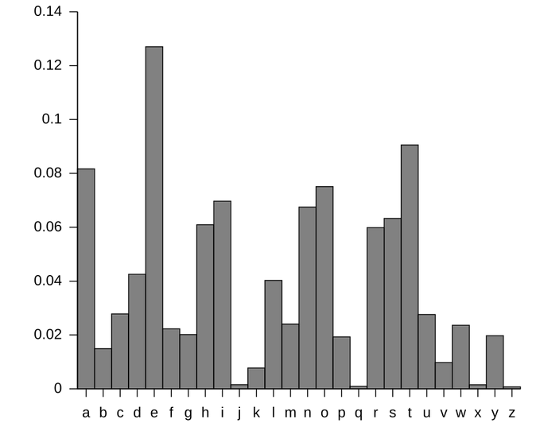

# Klasične i protočne šifre

## Definicija problema

> Ana i Boban žele da komuniciraju poverljivo putem javnog kanala (npr. pomoću
> interneta). Eva, koja prisluškuje komunikaciju, ne sme da sazna sadržaj
> poruka koje Ana i Boban razmenjuju. Na koji način Ana i Boban mogu da ostvare
> poverljivu komunikaciju?

Rešenje ovog problema svodi se na korišćenje šifri. Ana i Boban se mogu unapred
dogovoriti o šifri i ključu koji će koristiti. Pod ključem podrazumevamo neki
tajni podatak koji je poznat samo Ani i Bobanu, a pod šifrom podrazumevamo
algoritam koji proizvoljnu poruku uz dati ključ transformiše u nisku koju
nije moguće protumačiti i razlikovati od slučajne niske. Takvu nisku nazivamo
šifrovana poruka ili šifrat.

Formalnije, šifra je par algoritama \\((E, D)\\), gde je \\(E\\) algoritam
šifrovanja odnosno enkripcije, a \\(D\\) algoritam dešifrovanja odnosno
dekripcije. Algoritam \\(E\\) kao argumente prima poruku \\(m\\) i ključ
\\(k\\) i vraća šifrat \\(c = E(k, m)\\). Algoritam \\(D\\) kao argumente prima
šifrat \\(c\\) i ključ \\(k\\) i vraća poruku \\(m = D(k, c)\\). Šifra je takva
da za svaku poruku \\(m\\) i ključ \\(k\\) važi \\(D(k, E(k, m)) = m\\).

## Klasične šifre

Sada ćemo predstaviti nekoliko klasičnih šifri koje su se istoriјski koristile
za ostvarivanje poverljive komunikaciјe.

### Cezarova šifra

Cezarova šifra je jedna od najjednostavnijih šifri. Enkripcija se vrši
pomeranjem celog alfabeta za fiksan broj mesta \\(k\\). Na primer, za \\(k = 3\\),
alfabet izgleda ovako:

| A | B | C | D | E | F | G | H | I | J | K | L | M |
|---|---|---|---|---|---|---|---|---|---|---|---|---|
| D | E | F | G | H | I | J | K | L | M | N | O | P |

| N | O | P | Q | R | S | T | U | V | W | X | Y | Z |
|---|---|---|---|---|---|---|---|---|---|---|---|---|
| Q | R | S | T | U | V | W | X | Y | Z | A | B | C |

Poruka \\(m\\) se onda šifruje tako što se svako slovo u poruci menja
odgovarajućim slovom iz pomerenog alfabeta. Na primer, poruka `HELLO` se
šifruje kao `KHOOR`. Dešifrovanje se, jasno, vrši inverznim mapiranjem
karaktera.

Cezarova šifra je jednostavna, ali je veoma nebezbedna. Postoji samo 25 mogućih
ključeva (pomeraja), pa je moguće probati sve mogućnosti i pronaći pravi ključ.
Na primer, ako je data šifrovana poruka `ZRUOG`, možemo probati sve pomeraje
\\(k\\) redom i dešifrovati šifrovanu poruku dok ne dobijemo smislen rezultat:

~~~text
k=1  YQTNF
k=2  XPSME
k=3  WORLD
~~~

Ovaj postupak je moguće automatizovati statističkom analizom dobijenog teksta u
slučaju dužih poruka. Preciznije, možemo izračunati učestalost pojavljivanja
svakog slova u dobijenom tekstu. Svaki jezik ima karakterističnu raspodelu
učestalosti slova, pa možemo uporediti dobijenu raspodelu sa poznatom
raspodelom za ciljani jezik i izabrati onaj pomeraj koji daje najpribližniju
raspodelu. Na slici je prikazana učestalost pojavljivanja slova u engleskom
jeziku.

Naredna funkcija implementira jedan od načina za izračunavanje udaljenosti
raspodele učestalosti u poruci u odnosu na poznatu raspodelu za engleski jezik.

~~~python
def analyze(message, freq_eng):
  frequencies = {letter: 0.0 for letter in ascii_lowercase}
  for letter in message:
    if letter.islower():
      frequencies[letter] += 1 / len(message)

  score = 0
  for letter in ascii_lowercase:
    score += abs(frequencies[letter] - freq_eng[letter]) / 26
  return score
~~~

Nju možemo iskoristiti da pronađemo pravi pomeraj u Cezarovoj šifri, pokušavajući
svaki mogući pomeraj:

~~~python
for key in ascii_lowercase:
  message = "".join(dec(c, key) for c in ciphertext)
  score = analyze(message, freq_eng)
  if score < 0.01:
    print(f"Possible decryption for key {key} with score {score}")
    print(f"{message}")
~~~

### Vižnerova šifra

Vižnerova šifra je unapređenje nad Cezarovom šifrom koje koristi ključ u vidu
reči umesto fiksnog pomeraja. Svako slovo ključa određuje jednu vrednost
pomeraja Cezarove šifre (na osnovu svoje pozicije u alfabetu), a svako slovo
poruke se šifruje Cezarovom šifrom na odgovarajućoj poziciji. Na primer, ako je
ključ `SECRET`, odgovarajući pomeraji su dati u sledećoj tabeli:

|  S |  E |  C |  R |  E |  T |
|----|----|----|----|----|----|
| 17 |  4 |  2 | 16 |  4 | 18 |

Onda se poruka `HELLO` šifruje tako što se `H` šifruje Cezarovom šifrom sa
pomerajem 17, `E` šifruje Cezarovom šifrom sa pomerajem 4, itd. Rezultat
šifrovanja je `ZINCS`. U slučaju da je poruka duža od ključa, možemo zamisliti
da se ključ ponavlja dovoljan broj puta da pokrije celu poruku.

Vižnerova šifra je znatno bezbednija od Cezarove šifre, ali i dalje postoje
efikasni napadi na nju. Na primer, možemo pokušati takozvani napad rečnikom.
Ako je ključ kratak i poznatog je oblika (npr. jedna reč engleskog jezika, ili
neka reč sa spiska korišćenih i otkrivenić ključeva), možemo pokušati da
dešifrujemo poruku svim rečima iz rečnika. Zbog ovoga je najbolje koristiti
nasumične, dugačke ključeve i ne upotrebljavati isti ključ više puta.

~~~python
with open("dictionary.txt", "r") as file:
  for word in file:
    key = word.strip()
    message = "".join(dec(c, key[i % len(key)]) for i, c in enumerate(ciphertext))
    score = analyze(message, freq_eng)
    if score < 0.01:
      print(f"Possible decryption for key {key} with score {score}")
      print(f"{message}")
~~~

Postoje i sofisticiraniji napadi na Vižnerovu šifru. Na primer, ako je dužina
ključa \\(n\\) poznata, možemo podeliti šifrovanu poruku u \\(n\\) grupa, gde
svaka grupa sadrži karaktere koji su šifrovani pomoću istog pomeraja. Na
primer, ako pretpostavljamo da je dužina ključa 3, onda delimo poruku
`HELLOWORLD` u grupe `H..L..O..D`, `.E..O..R..` i `..L..W..L.`. Za svaku grupu
onda možemo primeniti analizu učestalosti slova kao u Cezarovoj šifri da bismo
otkrili odgovarajući pomeraj.

~~~python
subtexts = [ciphertext[i::length] for i in range(length)]
key_candidates = [get_caesar_keys(subtext, freq_eng) for subtext in subtexts]

for key in ["".join(prod) for prod in product(*key_candidates)]:
  message = "".join(dec(c, key[i % len(key)]) for i, c in enumerate(ciphertext))
  score = analyze(message, freq_eng)
  if score < 0.01:
    print(f"Possible decryption for key {key} with score {score}")
    print(f"{message}")
~~~

Možemo pokušati sve moguće dužine ključeva redom dok ne pronađemo smislen
rezultat. Ipak, dužinu ključa možemo pokušati i da procenimo pametnije.
Primetimo da ako u šifrovanoj poruci postoji segment koji se ponavlja, moguće
je da je u pitanju ista reč teksta koja je šifrovana istim delom ključa. Ako je
tako, to znači da je razmak između ta dva ponavljanja deljiv sa dužinom ključa.
Naravno, ne mora svako ponavljanje značiti da se ovaj scenario desio (ovo
postaje očigledno ako gledamo segmente dužine jedan karakter), ali što je duži
taj ponovljeni segment, to je verovatnije da se radi o takvom poklapanju.
Možemo odabrati dužinu \\(L\\) i pronaći sve ponovljene segmente dužine \\(L\\)
u šifrovanoj poruci. \\(L\\) biramo tako da bude dovoljno veliko da izbegnemo
previše slučajnih ponavljanja, ali i dovoljno malo kako bismo uhvatili dovoljan
broj ponavljanja. Dužina ključa je onda verovatno delilac nekog od razmaka
između pronađenih ponavljanja. Radi ubrzanja postupka možemo preskočiti sve
delioce koji se ne pojavljuju više od jednom. Ovaj postupak je poznat kao napad
Kasiskog. U nastavku je njegova implementacija.

~~~python
L = 5
gaps = []
for i in range(len(ciphertext) - L + 1):
  substring = ciphertext[i : i + L]
  gaps.extend(
    match.start() - i for match in re.finditer(substring, ciphertext[i + 1 :])
  )

divisors = {}
for gap in gaps:
  for d in get_divisors(gap):
    if d in divisors:
      divisors[d] += 1
    else:
      divisors[d] = 1

candidates = set()
for d in divisors:
  if divisors[d] > 1:
    candidates.add(d)
~~~

Nakon određivanja mogućih dužina ključeva, možemo pokušati da otkrijemo poruku
svakom od njih, prethodno opisanim postupkom.

### Jednokratna šifra (One-time pad)

Jednokratna šifra je šifra koja je teoretski neprobojna ako se koristi na
pravilan način. Ključ je slučajan niz bitova koji je jednako dug kao i poruka.
Enkripcija se vrši tako što se poruka kombinuje sa ključem pomoću operacije
XOR, odnosno \\(E(k,m) = k \oplus m\\). Jasno, dekripcija se vrši na isti
način, tj. \\(D(k, c) = k \oplus c\\).

Kako bi šifra zaista bila neprobojna, ključ mora biti slučajno generisan, iste
dužine kao i poruka, korišćen samo jednom i čuvan u tajnosti. Ako bar jedan od
ovih uslova nije ispunjen, šifra postaje podložna napadima.

Primera radi, recimo da smo poslali dve poruke \\(m_{1}\\) i \\(m_{2}\\)
enkriptovane istim ključem \\(k\\). Neka su šifrati \\(c_{1} = E(k, m_{1})\\) i
\\(c_{2} = E(k, m_{2})\\). Tada je \\(c_{1} \oplus c_{2} = (k \oplus m_{1})
\oplus (k \oplus m_{2}) = m_{1} \oplus m_{2}\\). Kako bismo najbolje prikazali
koliko je ovo katastrofalno, posmatrajmo šta se dobije ako su \\(m_{1}\\) i
\\(m_{2}\\) dve slike iste veličine:

Iako su slike pomešane XOR operacijom, moguće je tačno razaznati šta se nalazi
na kojoj slici (lav na jednoj, put u pustinji na drugoj).

Jasno je da ove uslove nije lako ispuniti u praksi. Jedan od pokušaja da se
napravi praktična jednokratna šifra je korišćenje generatora slučajnih
bitova. Ukoliko je generator dovoljno dobar, moguće je generisati dugačke
nizove bitova koji izgledaju nasumično i koristiti ih kao ključeve za OTP.

## Protočne šifre

Protočne šifre zasnivaju se na generisanju pseudoslučajnog niza bitova na
osnovu datog ključa, koji se na neki način kombinuje sa porukom, uglavnom XOR
operacijom. Preciznije, neka je \\(G\\) pseudoslučajni generator koji na osnovu
ključa \\(k\\) generiše niz bitova \\(b_{1}, b_{2}, \dots\\). Tada možemo
definisati protočnu šifru kao par algoritama \\((E, D)\\) gde je \\(E(k, m) =
G(k) \oplus m\\) i \\(D(k, c) = G(k) \oplus c\\). Primetimo da je ovo suštinski
jednokratna šifra, pri čemu sada ključ može biti kraći od poruke. Naglasimo da
ovim još uvek nismo rešili problem ponovnog korišćenja ključa.

Obradićemo konstrukciju protočne šifre zasnovane na linearnim povratnim šift
registrima. Ovakve protočne šifre su istoriјski bile veoma značajne, ali se
danas ne koriste u kriptografske svrhe zbog svojih slabosti.

### LFSR

Linearni povratni šift registar (eng. linear feedback shift register) drži
stanje od \\(n\\) bitova \\(s_{1}, \dots, s_{n}\\). Svaki naredni bit
pseudoslučajnog stanja računa se po formuli \\(s_{i} = c_{n} s_{i - n} \oplus
\dots \oplus c_{1} s_{i-1}\\) gde su \\(c_{1}, \dots, c_{n}\\) bitovi koji
definišu registar i služe da odaberu bitove trenutnog stanja na osnovu kojih se
računa naredni bit stanja. Za LFSR je usko vezan polinom \\(C(x) = c_{n} x^n +
\dots + c_{1} x + 1\\) sa koeficijentima u \\(\mathbb{F}_{2}\\).

Na primer, neka je LFSR dužine \\(n=4\\) definisan polinomom \\(x^4+x^3+x+1\\).
To znači da se naredni bit stanja računa po formuli \\(s_i = s_{i-4} \oplus
s_{i-3} \oplus s_{i-1}\\).

~~~text
 ┌──>s[i-1] s[i-2] s[i-3] s[i-4]───> output
 │     │             │      │
 └───[          XOR          ]
~~~

Ako je početno stanje \\(s_{i-1}, s_{i-2}, s_{i-3}, s_{i-4} = 1, 0, 0, 0\\),
prvih nekoliko koraka pomeranja registra izgleda ovako:

~~~text
 1 0 0 0       1 1 0 0       1 1 1 0       0 1 1 1       0 0 1 1    
 |   | |       |   | |       |   | |       |   | |       |   | |    
 +---+-+-> 1   +---+-+-> 1   +---+-+-> 0   +---+-+-> 0   +---+-+-> 0
~~~

Naredna funkcija implementira LFSR generator sa početnim stanjem `state`.
Generiše se `b` bitova pseudoslučajnog niza.

~~~python
def lfsr(state: list[int], b: int) -> list[int]:
  stream = state + [0] * b
  for i in range(len(state), len(stream)):
    stream[i] = stream[i - 1] ^ stream[i - 3] ^ stream[i - 4]
  return stream[len(state):]
~~~

Od LFSR generatora možemo napraviti protočnu šifru tako što ključ koristimo kao
početno stanje registra, a zatim generišemo niz bitova koji se kombinuju sa
porukom pomoću XOR operacije. Veličina ključa mora da odgovara veličini
registra.

~~~python
def encrypt(key: bytes, message: bytes) -> bytes:
  keystream = lfsr(bytes_to_bits(key), 8 * len(message))
  return xor(bits_to_bytes(keystream), message)

def decrypt(key: bytes, ciphertext: bytes) -> bytes:
  keystream = lfsr(bytes_to_bits(key), 8 * len(ciphertext))
  return xor(bits_to_bytes(keystream), ciphertext)
~~~

Kako bismo rešili problem ponovnog korišćenja ključa, moramo osigurati da LFSR
ne koristi isto početno stanje za različite poruke. Jedan od načina da se to
izbegne je korišćenjem inicijalizacionog vektora (IV). Inicializacioni vektor
je slučajni niz bitova koji se koristi zajedno sa ključem da bi se generisalo
početno stanje LFSR. Na primer, početno stanje registra se može inicijalizovati
kao konkatenacija ključa i inicijalizacionog vektora. Inicializacioni vektor se
šalje zajedno sa šifratom kao javno dostupan podatak, kako bi primalac mogao da
rekonstruiše početno stanje LFSR i dešifruje poruku. Ovo ne umanjuje bezbednost
šifre, već samo osigurava da se za različite poruke koristi različito početno
stanje LFSR.

Naredne funkcije implementiraju enkripciju i dekripciju pomoću LFSR sa
inicializacionim vektorom. Veličina registra treba da bude jednaka zbiru
veličine ključa i veličine inicijalizacionog vektora.

~~~python
def encrypt(key: bytes, message: bytes, iv: bytes) -> bytes:
  keystream = lfsr(bytes_to_bits(key+iv), 8 * len(message))
  return xor(bits_to_bytes(keystream), message)

def decrypt(key: bytes, ciphertext: bytes, iv: bytes) -> bytes:
  keystream = lfsr(bytes_to_bits(key+iv), 8 * len(ciphertext))
  return xor(bits_to_bytes(keystream), ciphertext)
~~~

Primetimo da ukoliko znamo \\(n\\) uzastopnih bitova generisanih LFSR
generatorom dužine \\(n\\), možemo lako odrediti sve bitove generatora (pošto
su pozicije registra fiksirani, javni podaci). Sve naredne bitove možemo
izračunati direktno primenom generatora. Prethodne bitove možemo izračunati
obrtanjem relacije. Na primer, ako se naredni bit računa kao \\(s_i = s_{i-1}
\oplus s_{i-3} \oplus s_{i-4}\\), onda važi \\(s_{i-4} = s_i \oplus s_{i-1}
\oplus s_{i-3}\\), odnosno \\(s_{j} = s_{j+4} \oplus s_{j+3} \oplus s_{j+1}\\)
uvođenjem smene \\(j=i-4\\). Naredna funkcija implementira određivanje
prethodnih \\(b\\) bitova LFSR generatora na osnovu datih \\(n\\) bitova
stanja.

~~~python
def lfsr_reverse(state: list[int], b: int) -> list[int]:
  stream = [0] * b + state
  for j in range(b - 1, -1, -1):
    stream[j] = stream[j + 4] ^ stream[j + 3] ^ stream[j + 1]
  return stream[:b]
~~~

### NLFSR

Jedan od načina da ojačamo LFSR generator je nelinearnim kombinovanjem više
LFSR generatora u takozvani NLFSR (nelinearni povratni šift registar)
generator. Prikazaćemo par primera NLFSR generatora.

#### Umanjujući generator

Umanjujući generator koristi dva LFSR. U svakom koraku pomeramo oba generatora
za jedan korak. Ukoliko prvi generator vrati 1, na izlaz NLFSR generatora
ispisujemo bit drugog generatora. Ako prvi generator vrati 0, bit drugog
generatora se preskače.

~~~text
 [LFSR A]───────┐
 [LFSR B]──[if A = 1]──> output

Primer:
 A: 0110101110
 B: 1010011100
 O:  01 0 110
~~~

#### Naizmenični generator

Naizmenični generator je NLFSR koji koristi tri LFSR generatora. Kontrolni
generator se pomera u svakom koraku. U zavisnosti od toga da li je generisao 0
ili 1 bira se koji od druga dva LFSR generatora se pomera. Na izlaz NLFSR se
ispisuje XOR izlaznih bitova drugog i trećeg LFSR (u XOR se koristi poslednji
generisan bit generatora koji nije pomeren).

~~~text
 [LFSR C]─┬─[LFSR A, clock if C = 0]─[XOR]─> output
          └─[LFSR B, clock if C = 1]───┘

Primer:
 C:  01100011
 A: 01..011..
 B: 1.01...01
 O:  01010010
~~~

## Zadaci

### Zadatak 1

Data je implementacija protočne šifre zasnovane na pseudoslučajnom generatoru
\\(G\\). Objasniti slabost ove implementacije i ispraviti je.

~~~python
def encrypt(key: bytes, message: bytes) -> bytes:
  generator = G(key)
  keystream = generator.generate(len(message))
  return xor(keystream, message)

def decrypt(key: bytes, ciphertext: bytes) -> bytes:
  generator = G(key)
  keystream = generator.generate(len(ciphertext))
  return xor(keystream, ciphertext)
~~~

### Zadatak 2

Klijent i server komuniciraju koristeći ključ \\(k\\) i šifru iz Zadatka 1.
Poruke koje razmenjuju definisane su nekim protokolom. Svaka poruka se
dopunjava slučajnim bajtovima do 16 bajtova pre šifrovanja. Spisak validnih
poruka je sledeći:

~~~text
LOGIN|<id>
LOGOUT
PING
SYNC
GET_STATUS
GET_TIMESTAMP
~~~

Poznate su šifrovane poruke:

~~~hex
b83f0d799979e6a47f4681d646e7143f
a7290475db7e3e56edd221347d73acbf
b83f0d7f825185169f6daa2bd7c9b9a8
b3351e699864a920a85fda54f346db8d
b83f0d7f825185019662f52865572129
~~~

Odrediti ID svih korisnika iz LOGIN poruka, ako je poznato da je dužina ID-a 6
bajta.

### Zadatak 3

Dat je šifrat `7dda6f65ea2aebf23a88925f66` dobijen šifrovanjem poruke pomoću
LFSR kom odgovara polinom \\(x^{16}+x^{15}+x^{13}+x^4+1\\). Poznat je deo
poruke `.........f2c2.............`. Odrediti celu poruku.

### Zadatak 4

Dat je šifrat `296a9e72bc5a98f910274dafeff61c5bd3` dobijen šifrovanjem poruke
pomoću LFSR kom odgovara polinom \\(x^{16}+x^{15}+x^{13}+x^4+1\\). Poznat je
deo poruke `......6.77.......................`. Odrediti celu poruku.

### Zadatak 5

Dat je šifrat `dfa9dfc3a06c9506b6fcc1ad0d290af6fb92047d` dobijen šifrovanjem
poruke pomoću LFSR kom odgovara polinom \\(x^{16}+x^{15}+x^{13}+x^4+1\\), sa
četvorobitnim inicijalnim vektorom `7`. Poznat je deo poruke
`.........d617...........................`. Odrediti dvanaestobitni ključ i
dešifrovati `2c3641c356038d362309704493c938221789db47` sa inicializacionim
vektorom `9`.

### Zadatak 6

Poruka se šifruje pomoću protočne šifre zasnovane na LFSR kom odgovara polinom
\\(x^{32}+1\\). Odrediti celu poruku. Pretpostaviti da je poruka tekst na
engleskom jeziku.

~~~hex
190f53071804531b15000107500e155304091653121400071c081d145002
1a07094d53041804011650151b1650131b0a04091e531f07531f19071653
12041207034101161c041d071c0400001c185f53040916011541160b1912
07005000530205001a1d04411f1a04151f1650031c1c1b12071c0204531d
110c16175043041b190c001a13001f5300001416034f51531e0400071c04
17531204070415041d53040e041602081d145012180a0302011200040100
5c41071b191253101800011e190f1453180005161e410701110f00031f13
07005008070050171a0019151c010341071c500053041f131f17500e1553
1c0807160200010a50041d1018001d071d041d075e41071b1541001b150d
0516034d531f190f161750161a071841111c1f0a00531f0753121c0d5300
180003160341121d1441001a0a04005f50161b1a031116015015121f1512
531c1641121706041d070513165f50131c1e110f10165c41121d14411e0a
03151601094f530718045312020e1e12500e155311061617501112031513
53121e055307180453001f070753131316121b081d14500e1553070e1c17
150f53151c0e1c01120e12011412531002041207154112531e0e0007110d
141a1341121e1208121d1304530718000753150c11011102160050040516
0218530519121a071f135d530409165300131c03020816071f135f53110f
53161302161d04131a1050031a111c081c0318081f1650161a0718411253
00041d1018001d0750071c015012071c021807161c0d1a1d174d53140204
16070341100603151c1e151300530708071b5000530411131e53030c1a1f
1541121d1441125317041d06190f165300000000190e1d53160e01530409
165307131a0704041d53070e01175e41120050111207020e1d00500c1612
1e05160150151b011f14141b50151b1650001a001c04005f50151b160941
1e1209410007050c111f154106031f0f531b190517161e41121f130e0516
034112171f131d161441041a04095305190f07121704531f1500071b1513
5e111f141d1750021f1203121a1003411c0150021c090941011611051a1d
17411d1c1f0a0053070916011541071a1d04530015041e0050151c530315
121d14410007190d1f5d50081d5304091a00500c12141902121f50120312
13045f5304091653120e061d1400011a1512531115150416150f53011500
1f1a041853121e0553151902071a1f0f53111c14015f50001d1750040516
021853111f0e18531204101c1d0400531141031c0215121f50151c531141
171a16071601150f07530204121f1d4d531a1e171a07190f145302041217
15130053040e53161d0312011b411c1d500d1a07151312010941191c0513
1d1609125307180007530413121d0302161d1441071b1541101c1e071a1d
1512531c1641071b1541160515130a1711185d5307091a1e030810121c41
0312170400530315121d141253120341125304040007110c161d0441071c
50151b1650041d1705131a1d1741031c070401531f07531f191516011115
06011541071c501501121e12031c02155f53190f00031913165f50001d17
50021c1d1e04100750140053040e53071804530511120753040003160315
010a500e155318141e121e411a1e11061a1d11151a1c1e4f
~~~

### Zadatak 7

Slika se šifruje pomoću protočne šifre zasnovane na LFSR kom odgovara polinom
\\(x^{16}+x^{15}+x^{13}+x^4+1\\). Odrediti sadržaj slike.

~~~hex
89504e470d0a1a0a0000000d494844520000002000000020080600000073
7a7af4000008344944415478019d9503942449d7869f1b9199c5665563b4
36ffffb36ddbb66ddbb66dae6ddbf66eef748faa594ade2f3aebd49999fe
3078ce79cf1b75e3aa2cec02e71efdedc3cebfe08a0f6edcb8e511d56ab9
f4f8c73df4add65a5cec07ebd76f6c4f8cd7ce79d8c3eef765e03a761239
e7a86fb3334c4f6f7cd509279efd7d552dfbbec7c8c8107beeb99a72a9c4
cccc26a6a66668b53b00eda73dedd16f057ec54ee0ad9fdec08e58985ffa
e459675ff229cfb3186350057776f272172379dc9d4992b47cd451a7fef2
518f7ad09ec0a777b8c0fcfc123be26c373c087c8c114028b873a55ca25a
29532806944a4582424018c5f87ebe8cabb9f8533bb5804b64474c4cd4ef
eab4bb7b0179f3ea4085e1e1410607ab78bec7d0d000032e962489530aaa
d46ac377b313789393636cba73fa88854efb2b5112ff7f9ca6e3d6983b2a
85c2ef064b956f02f3071cb0f71937df7cc76b008220606464905a7da4b7
80e71185118b8b4d9238a11b86a82afbefbfd7d900179e76d1f062a7f59e
5618be34d36c1fcfd84d05dfbf72b054fe00708dd972d7cc91cdb07b09f0
44cfdaf1c0f310619f66b7fb8999f9d99bba71f4bcf1b1daadeec3963fcb
d1d1212627c6a88d0ee78f2b95621e1b1f1bcdbd5aade07271afd0f49927
9ef3dce51eaed7c745649fc07a2ccf009ed80ec34b8c9823bd4cf56305cf
2fb8ed483327e7997317c7f9c442bbf5d7a3fe767c541fafbba643d446dc
02abea0c0d0f502c161011b24ca9bb05daad0eeda536cd668be38e3af93d
ae36f08cc138d9651783977b1e5b9ef93179f9a3dcabaeeaa96a7f68ee4e
f942bd78df357785dc0114107a88482ed3573ea8e7769b733fc779e2edb5
571027a97a619cd1eaa634dbc2fa2d29c82263e58472118200bc0258df60
82218c3700a60cf4be829a46a46907d22669b4e094118710c7d0ee0a8d8e
c1c808ab460c036543a968280406cf48ec8970a167e531990ad60869aaf8
a23cffd02e6375a5320ed5baa138fe50ccd043105bc688413503a4b740d6
7b7500d2788974fe22a22d17d06a6474362b9b1bc2df6fcc5031f8bea154
b0582b085ce401bf53784c962971a28409bce4b02d3cfcb098ca3ab7f19a
2ac19e6fc5940f00117254c911430fa51f5304d503a1f360a27b7e487766
91e63d29816ce1a83b27e84619e582c917007e6b803fb9e1d3d1f2f03863
9f6a9b271ddea5b68761745d81f23e6fc22bafc5d0e2862b2ee7154f7e39
375c7939860e469bf4d4e2c6abaee0e5eeeefacb2fc593b6ab59e36adfc6
e09a02a3aed7538fecb0ef609b6ea88489a2ca34f027037444787b1465c4
b1f282c3e629d52ca5bae04d3c1dec30244bb98efae3df182b2efbdf2159
a0a7c55cc7fcf91f4c949a1cf3a7fedd12980a76e29904a3823fecf18243
e70963258a3380b7674a473ef6aa07021086d90ba4bbf8c38f3e76e3a85d
ed51585bc7ae7ed5769ff3b7bcf4534c56ba6cea96f8de6f3e01f411def2
f24f3359eab0b1b3fd9d08a433bf219cda4c3a9df0d95327e6a432f826e0
2f005e1865fd1e7f79df03661ea045ffbdb60cb6b23fc4b3f42f55152fed
620cd8b88b46b380d043b151075301cfdd113700d32fc596f777da4c52b4
7ce08133bf80997c3880f7fec36ea64fb1c07db460b005c094d1a88188a2
2ace61682820cb2286470af97222a04a4ead5e2473c37b7773f450100153
c21604712a16b92fdbe0b9401fd4b307892f58ab48febd8e001055489798
dcb7cefa1ba659bdef2866f604344bc911cbc43e35a6ae5dcfea834791ce
5da8ad60b6f996580bc61732cf1eb8dd026e287d32919a674144206a201a
e71f284d1611521ef7ccbdf8f94db33cfe596bd1f42e008c902ff2d8a7ad
e367d73778dc33d642f35a442c78834e4360825e4fdb9bb1dd022e401f44
7a42a1732baa6c730707d5e7f9ea3f9f81de76352c41afb4e707aebc2345
e3392499fbb7fedbe2ad0834346395eaf6b9aa8000ad79f4aab37a7103fd
3cf8f73bd8be3e57060a8deddf02b641f5a634d1555906c628aaf0d2b736
087ca8568c93e43e50153c0be5b201857627234961a9a9345b9953cfe304
7efffd1a02a4b1e07a83eacddb2db0edeb2ca99e9b453c3a0e1553501058
b32660af87bf97fd0f3a82c3eff3202657ad0311fe23aa6c9899e2da2b2e
e2b69bafe5eef3be868a824212814692cf601b8c0bd097c9d27f68ac2421
6428586560cc67eaa6cb99befb166ebfe92aeebdfb3616e71bc451481f77
c6c5dcddaddc76e35579ee3d375ee66a83bc4746afa7c6f98cbf3bd1972c
7c63906d8902ff5c53b30f2b4da60403cae957f97ce71b1b0953c8145421
0350507a0880800164d9058a16def5fe091e79584cda16da33166da4e701
0f671bbca4e0b37d20fd58dcb667c64b22b6a83cecff956b1e31c435972e
602d880165c59fa280d0539a39a5f0c0478ef0e0233234866851485ba8eb
fd71562073df1e662589b13f66c8bca1389e51ac65844375bef9897bd93c
d5a15c846200be07c6000a99429c402784b6d3c49e65def3a955f80bb384
b386ee46038bd94f8037b2022fb596950471fceea81d1c19cdda078a85c0
ccf28ecfedc5efbe33cd0dee95e846e0d97c819c2ceb2d10a7f0ff0f1fe1
c56f9ec49bdd44386f081b166d67172ff7e43f200bdf1ce43f911953736f
cff152950706231985bae0adad73f32d09179dd2e08eeb9b2cccc5880883
a33efb1f5ee5c14facb3dfde104d35881acee70cdad48bbd307e2ad000d8
f15bb03da524f0bea94579835741fcaae24f14f0c7ab48b988580b802609
daee126f6a3a45c44d2169a1d2d59f7851f21ea00db03b0be4a4d63e32f3
ede708789809c01614e32b62c9d114b2584843218b8088f34c9c7fe0ce62
07c896efd5d8050e5023cf526b9e80e5108cf48a336d907283a4d92992e9
51c02dec24ff02a26611a245b370220000000049454e44ae426082
~~~
