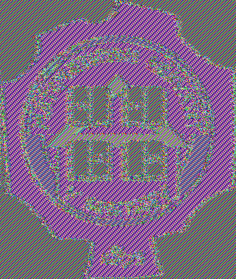

# Blok šifre, operacioni modovi i autentifikacija

## Definicija problema

> Ana i Boban žele da komuniciraju poverljivo putem nebezbednog javnog kanala
> (npr. pomoću javne WiFi mreže). Eva, koja kontroliše kanal, može da
> prisluškuje komunikaciju, ali i da menja sadržaj svake poruke. Na koji način
> Ana i Boban mogu da ostvare poverljivu komunikaciju, a da pritom otkriju
> ukoliko je bilo koja poruka izmenjena?

Blok šifre su osnovne kriptografske primitive nad kojima je izgrađena većina
modernih šifarskih sistema. Osim što nude rešenje za problem poverljive
komunikacije, takođe omogućavaju konstrukciju takozvane autentifikovane
enkripcije.

Formalno, blok šifra je šifra \\((E, D)\\) pri čemu je veličina poruke, odnosno
šifrata, fiksirana na \\(n\\) bitova. Kažemo da je \\(n\\) veličina bloka.
Naglasimo da se, zbog tog uslova, blok šifrom ne mogu direktno šifrovati
proizvoljne poruke. Za fiksirani ključ \\(k\\), funkcija \\(E_k(m) = E(k, m)\\)
je permutacija skupa svih bitovskih niski dužine \\(n\\). Cilj prilikom
dizajniranja blok šifre je da se funkcija \\(E_k\\) ponaša kao pseudoslučajna
permutacija (eng. pseudorandom permutation, PRP) za svaki ključ \\(k\\).

## Konstrukcije blok šifre

Uopšteno, blok šifre se konstruišu iterativnom primenom neke jednostavne
invertibilne transformacije koja zavisi od ključa, pri čemu jednu iteraciju
nazivamo rundom, a tu transformaciju funkcijom runde. Ključ \\(k\\) se
proširuje u niz podključeva \\(k_1, \dots, k_r\\) (po jedan za svaku rundu)
jednostavnim pseudoslučajnim generatorom.

~~~python
def encrypt_block(key: bytes, block: bytes) -> bytes:
  keys = key_expansion(key, rounds)
  for k in keys:
    block = round_function(k, block)
  return block

def decrypt_block(key: bytes, block: bytes) -> bytes:
  keys = key_expansion(key, rounds)
  for k in reversed(keys):
    block = round_inverse(k, block)
  return block
~~~

### Osnovne komponente

Dve osnovne komponente koje se koriste u konstrukciji blok šifri su P-tabela
(P-box) i S-tabela (S-box).

P-tabela, uslovno rečeno, vrši permutaciju pozicija bitova. Preciznije,
preslikava \\(m\\) ulaznih bitova u \\(n\\) izlaznih bitova promenom njihovog
redosleda. P-tabela može da permutuje bitove u slučaju da je \\(m=n\\), ali i
da proširi ako je \\(n>m\\), odnosno kompresuje ako je \\(m>n\\).

~~~text
0 1 1 1 0 1 0 1         0   0   1   0         1 1 1 0 0 1 1 0
│ │ │ │ │ │ │ │         │   │   │   │         │ │ │ │ │ │ │ │
0 1 2 3 4 5 6 7         0   1   2   3         0 1 2 3 4 5 6 7
[    P-box    ]        [    P-box    ]        [    P-box    ]
3 2 7 6 1 0 5 4        0 1 2 3 3 2 1 0         0   2   4   6 
│ │ │ │ │ │ │ │        │ │ │ │ │ │ │ │         │   │   │   │ 
1 1 1 0 1 0 1 0        0 0 1 0 0 1 0 0         1   1   0   1 
~~~

S-tabela je komponenta koja vrši supstituciju, odnosno preslikava \\(m\\)
ulaznih bitova u \\(n\\) izlaznih bitova, najčešće definisane pomoću lookup
tabele. Dobro odabrana S-box funkcija uvodi nelinearnost u šifru, otežavajući
kriptoanalizu i pokušaje napada. Nelinearnost podrazumeva da se izlazni bitovi
ne mogu izraziti kao linearne funkcije ulaznih bitova. Za razliku od S-tabele,
P-tabela je linearna transformacija, jer se svaki izlazni bit \\(y_j\\)
predstavlja trivijalnom formulom \\(y_j = x_i\\) gde je \\(x_i\\) neki ulazni
bit. U nastavku je primer S tabele koja preslikava 4 bita u 3 bita:

~~~text
4 bita -> 3 bita (prvi bit određuje red, preostala tri kolonu)

  │ 0 1 2 3 4 5 6 7
──┼────────────────
0 │ 6 0 1 7 2 4 5 3
1 │ 7 6 5 3 0 1 4 2

S(3)  = 7 jer je 3  = 0.011 odnosno (0, 3)
S(13) = 1 jer je 13 = 1.101 odnosno (1, 5)
~~~

### Fajstelova mreža

Fajstelova mreža je konstrukcija koja omogućava da od proizvoljne funkcije
\\(f(k, b)\\) formiramo blok šifru. Blok se deli na dva dela, \\(b=l \parallel
r\\). U jednoj rundi Fajstelove mreže se blok transformiše po formuli \\(l
\parallel r \to r \parallel l \oplus f(k, r)\\). Primetimo da je ova
transformacija invertibilna, bez obzira na to da li je funkcija \\(f\\)
invertibilna.

~~~python
def round_function(key: bytes, block: bytes) -> bytes:
  n = len(block) // 2
  left, right = block[:n], block[n:]
  return right + xor(left, f(key, right))

def round_inverse(key: bytes, block: bytes) -> bytes:
  n = len(block) // 2
  left, right = block[:n], block[n:]
  return xor(right, f(key, left)) + left
~~~

DES je primer šifre zasnovane na Fajstelovoj konstrukciji. Radi nad
blokovima veličine 64 bita, sa ključem veličine 56 bitova i izvršava se u 16
rundi. Funkcija \\(f\\) je definisana kombinovanjem nekoliko pažljivo odabranih
S-tabela sa jednom P-tabelom.

### SP mreža

SP mreža (eng. Substitution-Permutation network, SPN) je konstrukcija koja se
zasniva na naizmeničnoj primeni S-tabela i P-tabele. Sve operacije moraju biti
invertibilne kako bi dešifrovanje bilo moguće. Preciznije, u svakoj rundi se
ključ runde kombinuje sa blokom pomoću xor operacije, zatim se na segmente
bloka primenjuju S-tabele, nakon čega se primenjuje P-tabela. Naredne funkcije
implementiraju rundu SP mreže i njenu inverznu funkciju. Ukoliko je veličina
S-tabele \\(s\\) bita, funkcija `sbox` deli blok na segmente veličine \\(s\\)
bita i na svaki segment primenjuje S-tabelu.

~~~python
def round_function(key: bytes, block: bytes) -> bytes:
  block = xor(block, key)
  block = sbox(block)
  block = pbox(block)
  return block

def round_inverse(key: bytes, block: bytes) -> bytes:
  block = pbox_inverse(block)
  block = sbox_inverse(block)
  block = xor(block, key)
  return block
~~~

Kako je poslednja primena S-tabele i P-tabele invertibilna, potrebno je
primeniti još jedan xor sa ključem na kraju šifrovanja. To znači da
proširivanje ključa mora da generiše \\(r+1\\) podključeva.

~~~python
def encrypt_block(key: bytes, block: bytes) -> bytes:
  keys = key_expansion(key, rounds)
  for k in keys[0:-1]:
    block = round_function(k, block)
  block = xor(block, keys[-1])
  return block

def decrypt_block(key: bytes, block: bytes) -> bytes:
  keys = key_expansion(key, rounds)
  block = xor(block, keys[-1])
  for k in reversed(keys[0:-1]):
    block = round_inverse(k, block)
  return block
~~~

AES je primer blok šifre zasnovane na SPN konstrukciji. Radi nad blokovima
veličine 128 bita, sa ključevima veličine 128, 192 ili 256 bita i izvršava se u
10, 12 ili 14 rundi, zavisno od veličine ključa. Supstitucija (SubBytes korak)
u AES se radi nad bajtovima. Konstruisana je kao kombinacija multiplikativnog
inverza u \\(F_{2^8}\\) i afine transformacije. Permutacija u AES se vrši u
dva koraka. Blok se posmatra kao matrica dimenzije 4x4 bajta. Prvo se vrši
ciklično pomeranje redova matrice (ShiftRows korak), nakon čega se svaka kolona
transformiše množenjem sa fiksnom invertibilnom matricom nad \\(F_{2^8}\\)
(MixColumns korak). Iako MixColumns korak nije striktno P-tabela, on ispunjava
ulogu mešanja bitova u bloku linearnom transformacijom i na taj način se može
posmatrati kao uopštenje P-tabele.

## Operacioni modovi

Kako bismo šifrovali poruke proizvoljne dužine koristeći blok šifre, potrebno
je da definišemo operacioni mod šifrovanja.

### ECB

ECB (eng. Electronic Codebook) je najjednostavniji operacioni mod. Poruka se
deli na blokove i svaki blok se šifruje zasebno.

~~~python
def encrypt(key: bytes, message: bytes) -> bytes:
  blocks = bytes_to_blocks(message)
  ciphertext = bytes()
  for block in blocks:
    ciphertext += encrypt_block(key, block)
  return ciphertext

def decrypt(key: bytes, ciphertext: bytes) -> bytes:
  blocks = bytes_to_blocks(ciphertext)
  message = bytes()
  for block in blocks:
    message += decrypt_block(key, block)
  return message
~~~

Primetimo da ukoliko veličina poruke nije deljiva veličinom bloka, ne možemo
direktno primeniti ovaj pristup. Zato se svaka poruka dopunjava (eng. padding)
do veličine deljive veličinom bloka. Ovaj postupak mora biti invertibilan kako
bismo mogli da uklonimo dopunu prilikom dešifrovanja. Jedan od najčešće
korišćenih načina za dopunu poruke je PKCS#7 standard, gde ukoliko je potrebno
dodati \\(p\\) bajtova dopune, dodajemo tih \\(p\\) bajtova na kraj poruke, a
svaki od tih bajtova ima vrednost \\(p\\). Na primer, ako je veličina bloka 8
bajtova, poruka `48 45 4C 4C 4F` se dopunjuje sa tri bajta `03 03 03`. Kako bi
dopuna bila invertibilna, u slučaju da je poruka već deljiva veličinom bloka,
dodaje se ceo novi blok. Recimo da treba šifrovati poruku `57 4F 52 4C 44 03 03
03`. Ako je ne bismo dopunili, ne bismo mogli da razlikujemo između originalne
poruke i poruke `57 4F 52 4C 44` koja je dopunjena sa tri bajta `03 03 03`.
Stoga, poruka se dopunjuje blokom `08 08 08 08 08 08 08 08`.

Naglasimo da ECB mod nije bezbedan za upotrebu u praksi, zbog toga što se
isti blokovi poruke šifruju u isti blok šifrata. Sledeća slika najbolje
illustruje ovaj problem.

### CBC

Jedan od načina da se prevaziđu nedostaci ECB moda je korišćenjem CBC (eng.
Cipher Block Chaining) moda. Blok poruke se pre šifrovanja kombinuje sa
prethodnim blokom šifrata pomoću xor operacije. Za prvi blok se koristi
nasumični inicijalizacioni vektor (IV). Slično kao i kod ECB moda, poruka se
dopunjava do veličine deljive veličinom bloka.

~~~python
def encrypt(key: bytes, message: bytes, iv: bytes) -> bytes:
  blocks = bytes_to_blocks(message)
  cipher = [iv]
  for block in blocks:
    cipher.append(encrypt_block(key, xor(block, cipher[-1])))
  return blocks_to_bytes(cipher)

def decrypt(key: bytes, ciphertext: bytes) -> bytes:
  blocks = bytes_to_blocks(ciphertext)
  message = bytes()
  for i in range(1, len(blocks)):
    message += xor(decrypt_block(key, blocks[i]), blocks[i-1])
  return message
~~~

### CTR

Moderaniji pristup šifrovanju blok šifrom je CTR (eng. Counter) mod. Ovo je
način da se od blok šifre konstruiše protočna šifra. Počevši od nekog slučajno
odabranog brojača, odnosno inicijalizacionog vektora \\(n\\) (eng. nonce),
generiše se niz blokova \\(E(k, n), E(k, n+1), E(k, n+2), \dots\\). Poruka se
kombinuje sa ovim blokovima pomoću xor operacije. Za razliku od prethodna dva
moda, ovde nije potrebna dopuna poruke. Još jedna prednost CTR moda je što se
blokovi mogu šifrovati paralelno, što nije slučaj kod CBC moda. Takođe,
dešifrovanje se ne oslanja na algoritam dešifrovanja blok šifre, što može
pojednostaviti implementaciju.

~~~python
def encrypt(key: bytes, message: bytes, n: int) -> bytes:
  keystream = bytes()
  for i in range(0, 1 + len(message) // block_size):
    keystream += encrypt_block(key, int.to_bytes(n + i, block_size))
  return xor(message, keystream)

def decrypt(key: bytes, ciphertext: bytes, n: int) -> bytes:
  keystream = bytes()
  for i in range(0, 1 + len(ciphertext) // block_size):
    keystream += encrypt_block(key, int.to_bytes(n + i, block_size))
  return xor(ciphertext, keystream)
~~~

## Kodovi za autentifikaciju

Blok šifre možemo koristiti kao osnovu za konstrukciju kodova za
autentifikaciju poruka (eng. message authentication code, MAC). Ukratko, uz
svaku poruku \\(m\\) pomoću tajnog ključa \\(k\\) računamo kratak podatak, tzv.
tag \\(t = \text{MAC}(k, m)\\), koji šaljemo uz poruku. Primalac, koji takođe
poseduje ključ \\(k\\), može da proveri da li je poruka autentična tako što
nezavisno izračuna tag primljene poruke i uporedi ga sa primljenim tagom.
Ukoliko se tagovi ne poklapaju, znamo da je poruka izmenjena ili da ne potiče
od pošiljaoca koji poseduje ključ.

### CBC-MAC

Jedan od najjednostavnijih načina da se konstruše MAC je korišćenjem CBC
operacionog moda. CBC-MAC se računa tako što se poruka transformiše u CBC modu
sa inicijalizacionim vektorom postavljenim na nulu, a kao tag se uzima
poslednji izračunat blok. Naglasimo da se ovde CBC mod ne koristi za šifrovanje
poruke, kao i da sama poruka ne mora uopšte biti tajna ako to nije neophodno.

~~~python
def mac(key: bytes, message: bytes) -> bytes:
  blocks = bytes_to_blocks(message)
  cipher = [int.to_bytes(0, block_size)] # Prvi blok je IV = 0
  for block in blocks:
    cipher.append(encrypt_block(key, xor(block, cipher[-1])))
  return cipher[-1]

def verify(key: bytes, message: bytes, tag: bytes) -> bool:
  return mac(key, message) == tag
~~~

Napomenimo da je CBC-MAC u ovom obliku bezbedan samo za poruke fiksne dužine. U
suprotnom, moguće je izvesti napade na autentičnost poruka. Neka su poznate dve
poruke \\(m_{1}\\) i \\(m_{2}\\) sa odgovarajućim tagovima \\(t_{1}\\) i
\\(t_{2}\\). Napadač može da konstruše novu poruku \\(m_{3} = m_{1} \parallel
m_{2}^{\prime}\\) gde se \\(m_{2}^{\prime}\\) dobija od \\(m_{2}\\) tako što se
prvi blok xor-uje sa \\(t_{1}\\). Odgovarajući tag \\(t_{3}\\) za ovu poruku
biće jednak \\(t_{2}\\) zato što prilikom računanja CBC za prvi blok
\\(b^{\prime}\\) poruke \\(m_{2}^{\prime}\\) važi \\(E(k, b^{\prime} \oplus
t_{1}) = E(k, b \oplus t_{1} \oplus t_{1}) = E(k, b)\\) gde je \\(b\\) prvi
blok poruke \\(m_{2}\\). To znači da napadač može da konstruiše poruku sa
validnim tagom bez poznavanja ključa.

Jedan od načina da se ovaj problem izbegne je da se na početak svake poruke
doda jedan blok koji sadrži dužinu poruke. Na taj način, prethodni napad nije
moguć jer dužina poruke \\(m_{3}\\) ne bi odgovarala dužini poruke \\(m_{2}\\),
što znači da tag \\(t_{2}\\) ne bi bio validan za poruku \\(m_{3}\\).

~~~python
def mac(key: bytes, message: bytes) -> bytes:
  length = int.to_bytes(len(message), block_size)
  blocks = [length] + bytes_to_blocks(message)
  cipher = [int.to_bytes(0, block_size)]
  for block in blocks:
    cipher.append(encrypt_block(key, xor(block, cipher[-1])))
  return cipher[-1]

def verify(key: bytes, message: bytes, tag: bytes) -> bool:
  return mac(key, message) == tag
~~~

### Enkripcija i autentifikacija

Ukoliko želimo da ostvarimo i poverljivost i autentčnost poruka, možemo
kombinovati šifrovanje i MAC. Koristimo dva različita ključa za ove dve
operacije. Postoje tri osnovna pristupa:

- Encrypt-then-MAC: Prvo se poruka šifruje, a zatim se nad šifratom računa MAC.
- Encrypt-and-MAC: Poruka se šifruje i nad njom se računa MAC.
- MAC-then-encrypt: Prvo se računa MAC nad porukom, zatim se poruka i tag
  kombinuju i šifruju zajedno.

Od ova tri pristupa, Encrypt-then-MAC je najotporniji na napade. Bez ulaženja u
detalje, na intuitivnom nivou možemo razumeti princip da ne želimo uopšte da
pokušamo da dešifrujemo poruku ukoliko nismo sigurni da je autentična.

## Zadaci

Napadi:

- spn bez s-box izracunavanje kljuca
- spn bez p-box izracunavanje kljuca
- spn sa linearnim s-box izracunavanje kljuca
- feistel sa linearnom f izracunavanje kljuca
- napad na ecb
- cbc-mac napad
- cbc-mac napad na losu implementaciju gde se duzina dodaje na kraj poruke
- neki encrypt-and-mac error/padding oracle napad (data je gotova
implementacija servera sa kojom studenti mogu da interaguju)
