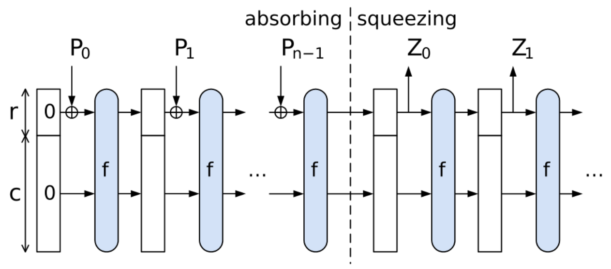

# Heš funkcije i obavezivanja

## Definicija problema

> Ana ima neki podatak \\(m\\) koji želi kasnije da pošalje Bobanu, ali možda
> ne želi odmah da ga otkrije. Boban želi da dobije garanciju od Ane da, kada
> mu Ana konačno pošalje neki podatak (možda i pomoću nekog posrednika, Eve),
> on može nezavisno da se uveri da je zaista dobio podatak \\(m\\).

Kriptografska heš funkcija je kriptografska primitiva koja nam omogućava da
proizvoljnom podatku pridružimo kratak "otisak prsta". Formalnije,
kriptografksa heš funkcija preslikava proizvoljnu poruku \\(m\\) u niz bitova
\\(h(m)\\) fiksne dužine \\(n\\) (npr. 256), pri čemu mora da poseduje sledeća
svojstva:

1. *Otpornost na inverznu sliku*: Za dato \\(d\\) nije moguće pronaći poruku
   \\(m\\) tako da je \\(h(m) = d\\).
1. *Otpornost na drugu inverznu sliku*: Za dato \\(m\\) nije moguće pronaći
   poruku \\(m'\\) različitu od \\(m\\) tako da je \\(h(m) = h(m')\\).
1. *Otpornost na kolizije*: Nije moguće pronaći par različitih poruka \\(m\\) i
   \\(m'\\) tako da je \\(h(m) = h(m')\\).

U ovom kontekstu, izraz "nije moguće" znači da ne postoji algoritam koji može
da izračuna traženi rezultat u nekom razumnom vremenu.

## Konstrukcija heš funkcije

Konstrukcije kriptografskih heš funkcija se uglavnom zasnivaju na iterativnoj
primeni neke funkcije \\(f\\). Svojstva funkcije \\(f\\) se mogu razlikovati u
zavisnosti od konstrukcije.

### Merkle-Damgard konstrukcija

Merkle-Damgard konstrukcija koristi funkciju \\(f\\) koja preslikava par
blokova veličine \\(n\\) u blok veličine \\(n\\). Poruka \\(m\\) se deli na
blokove veličine \\(n\\) i računa se niz stanja \\(s_{i} = f(s_{i-1}, m_{i})\\)
pri čemu se za \\(s_0\\) uzima algoritmom definisan inicializacioni vektor. Za
vrednost funkcije \\(h(m)\\) se uzima poslednje stanje \\(s_k\\). Kako bi
funkcija \\(h\\) ispunjavala željena svojstva, dovoljno je da ih zadovoljava i
funkcija \\(f\\).

~~~python
def md_hash(message: bytes) -> bytes:
  state = iv
  for block in bytes_to_blocks(message):
    state = f(state, block)
  return state
~~~

Primetimo da dužina poruke \\(m\\) ne mora biti deljiva sa \\(n\\). U tom
slučaju je potrebno dopuniti poruku, npr. dodavanjem niza bitova oblika
`100...0`.

~~~python
def pad(message: bytes) -> bytes:
  padded = message + b"\x80"
  pad_len = (-len(padded)) % block_size
  return padded + (b"\x00" * pad_len)
~~~

Neke od najpoznatijih heš funkcija, kao što su MD5 i SHA-1, su konstruisane
Merkle-Damgard konstrukcijom. Zbog određenih slabosti njihovih funkcija \\(f\\)
koje su otkrivene tokom godina, više se ne smatraju bezbednim. SHA-2 je primer
heš funkcije konstruisane Merkle-Damgard konstrukcijom koja se još uvek smatra
bezbednom i koja je još uvek u upotrebi.

### Sunđer konstrukcija

Sunđer konstrukcija se oslanja na funkciju \\(f\\) koja je bijekcija i koja ima
svojstva pseudoslučajne permutacije. Tokom konstrukcije održava se stanje \\(s
= [ r, c ]\\), gde \\(r\\) predstavlja deo stanja koji se direktno kombinuje
sa ulaznom porukom operacijom xor, dok \\(c\\) predstavlja unutrašnje stanje
heša.

Heš funkcija se dobija tako što se prvo "upija" poruka, odnosno tako što se
svaki blok poruke XOR-uje sa trenutnim \\(r\\). Između svaka dva bloka se
stanje \\([ r, c ]\\) transformiše funkcijom \\(f\\), odnosno \\(s_i = [r_i, c_i] =
f([r_{i-1} \oplus m_i, c_{i-1}])\\). Nakon upijanja svih blokova, vrednost heš
funkcije se "istiskuje", odnosno čitaju se blokovi iz \\(r\\) do željene dužine heš
vrednosti.

Najpoznatiji primer heš funkcije konstruisane sunđer konstrukcijom je SHA-3,
koja se takođe smatra bezbednom i koja je u širokoj upotrebi.

<!-- TODO -->
~~~python
def absorb(state, block):
  absorbed = xor(state[:r], block) + state[r:]
  return f(absorbed)

def squeeze(state):
  return state[:r], f(state)

def sponge(data, output_blocks):
  state = [0] * (r + c)
  for block in bytes_to_blocks(pad(data), r):
    state = absorb(state, block)
  hash = []
  for _ in range(output_blocks):
    output, state = squeeze(state)
    hash.append(output)
  return bytes_from_blocks(hash)
~~~

## HMAC

Jedan pokušaj da se konstruiše MAC na osnovu heš funkcije \\(h\\) za poruku
\\(m\\) i ključ \\(k\\) bi bio da se tag izračuna kao heš konkatenacije ključa
i poruke, tj. \\(h(k \mid m)\\). Ispostavlja se da za heš funkcije konstruisane
Merkle-Damgard konstrukcijom ovaj pristup nije bezbedan.

Pretpostavimo da je poruka \\(m\\) autentifikovana ključem \\(k\\) i da je tag
\\(t = h(k \mid m)\\). Jednostavnosti radi, pretpostavimo da se \\(k \mid m\\)
može tačno podeliti na blokove. Vrednost \\(t\\) je zapravo poslednje stanje u
Merkle-Damgard konstrukciji, tj. \\(t = s_k\\). Napadač može izračunati tag za
bilo koju poruku \\(m' = m \mid e\\) izračunavajući naredne blokove stanja
počevši od stanja \\(t\\) za produžetak \\(e\\) poruke. Poslednje stanje
\\(t'\\) je validan tag za poruku \\(m'\\) i ključ \\(k\\), iako napadač ne zna
vrednost ključa.

Jedan način da se reši ovaj problem je korišćenjem HMAC konstrukcije. HMAC se
računa kao \\(h((k \oplus opad) \mid h((k \oplus ipad) \mid m))\\), gde su \\(opad\\)
i \\(ipad\\) predefinisane konstante. Ova konstrukcija je bezbedna čak i kada
se koristi sa heš funkcijama konstruisanim Merkle-Damgard konstrukcijom.

## Identifikacija i integritet podataka

Heš funkcije imaju široku primenu u kriptografiji. Jedna od tipičnih primena je
identifikacija velikih podataka. Na primer, česta je pojava da se različiti
softverski paketi (npr. distribucije Linuxa) mogu preuzeti pomoću BitTorrent
protokla. Proizvođači softvera u tom slučaju objavljuju heš vrednost
instalacionog fajla, a korisnici fajl mogu preuzeti od bilo kojih učesnika u
mreži. U integritet preuzetih podataka moguće je uveriti se izračunavanjem heš
vrednost preuzetog fajla i upoređivanjem sa objavljenom hešom. Na ovaj način
korisnik ne mora verovati drugim učesnicima u mreži, kao ni konkretnoj
implementaciji BitTorrent klijenta, da bi se uverio da je preuzeo željeni fajl
u potpunosti.

Još jedna tipična primena heš funkcija je prilikom prijavljivanja na sajt
pomoću lozinke. Najjednostavniji način da se omogući prijavljivanje pomoću
lozinke je da se u bazi podataka uz nalog čuva i sama lozinka. Ovo naravno nije
bezbedno, jer bilo koji napadač koji dobije pristup bazi podataka automatski
dobija pristup lozinkama svih korisnika. Bolji pristup je čuvanje heš vrednosti
loozinke. Prilikom prijavljivanja, korisnik unosi lozinku, a server računa heš
vrednost unete lozinke i omogućava pristup korisniku ukoliko se dobijena
vrednost poklapa sa vrednošću iz baze.

## Kriptografsko obavezivanje

Kriptografska šema za obavezivanje (eng. *commitment scheme*) je postupak koji
omogućava korisniku da se obaveže na neki podatak, bez da mora taj podatak
odmah da otkrije. Sastoji se iz dve faze:

1. *Vezivanje*: Korisnik objavljuje vrednost \\(c\\) koja je na neki način
   izvedena iz podatka \\(m\\) na koji se obavezuje, bez otkrivanja podatka
   \\(m\\).
2. *Otkrivanje*: Korisnik otkriva podatak \\(m\\) i dokazuje da je \\(c\\)
   izveden iz \\(m\\).

Vrednost \\(c\\) je potrebno odabrati tako da je sakriva podatak \\(m\\),
odnosno da se na osnovu \\(c\\) ne može izračunati \\(m\\) (svojstvo
sakrivanja), ali i da nije moguće lažirati vezivanje, odnosno da nije moguće
pronaći podatak \\(m'\\) iz kojeg se takođe izvodi obavezujuća vrednost \\(c\\)
(svojstvo vezivanja).

Heš funkcije se prirodno nameću kao primitiva u izgradnji ovakve šeme. Korisnik
može da se obaveže na podatak \\(m\\) objavljivanjem heš vrednosti \\(c =
h(m)\\).

~~~python
def commit(message: bytes) -> bytes:
  return h(message)

def verify(commitment: bytes, message: bytes) -> bool:
  return h(message) == commitment
~~~

Međutim, ovaj pristup nije u potpunosti bezbedan. Recimo da korisnik želi da se
obaveže na podatak \\(m\\) iz nekog malog skupa, npr. \\({1, 2, 3, 4}\\).
Napadač može lako da izračuna heš vrednosti \\(h(1), h(2), h(3), h(4)\\) i da
proveri sa kojom od ovih vrednosti se poklapa objavljena vrednost \\(c\\),
narušavajući svojstvo skrivanja. Sa druge strane, čak i ako je skup vrednosti
dovoljno velik, ako se korisnik više puta obaveže na istu vrednost, napadač će
to moći da prepozna bez ikakvog napora. Rešenje prethodno navedenih problema je
dodavanje pseudoslučajnog podatka \\(r\\) prilikom vezivanja. Obavezujuća
vrednost se računa kao \\(c = h(m \mid r)\\).

~~~python
def commit(message: bytes) -> tuple[bytes, bytes]:
  r = secrets.token_bytes(16)
  c = h(message + r)
  return c, r # Objavljujemo samo c

def verify(commitment: bytes, message: bytes, r: bytes) -> bool:
  return h(message + r) == commitment
~~~

## Zadaci

### Zadatak 1

Odrediti dve različite poruke \\(m_1\\) i \\(m_2\\) koje imaju istu vrednost
heš funkcije definisane na sledeći način:

~~~python
import kurs

def h(message: bytes) -> bytes:
  state = kurs.md_iv
  for block in bytes_to_blocks(message):
    state = kurs.md_f(state, block)
  return state
~~~

### Zadatak 2

Neka je data poruka `TODO` i njen tag `TODO` izračunat pomoću HMAC-a
definisanog u nastavku. Bez poznavanja ključa, odrediti novu poruku čiji je tag
validan za taj ključ.

~~~python
def mac(key: bytes, message: bytes) -> bytes:
  return md_hash(key + message)

def verify(key: bytes, message: bytes, tag: bytes) -> bool:
  return mac(key, message) == tag
~~~

### Zadatak 3

Neka je data poruka `TODO` i njen tag `TODO` izračunat pomoću HMAC-a iz
prethodnog zadatka. Bez poznavanja ključa, odrediti novu poruku čiji je tag
validan za taj ključ.

~~~python
block_size = 16

def mac(key: bytes, message: bytes) -> bytes:
  return md_hash(pad10(key + message, block_size))

def verify(key: bytes, message: bytes, tag: bytes) -> bool:
  return mac(key, message) == tag
~~~

### Zadatak 4

Definisana je šema za obavezivanje na sledeći način:

1. Korisnik objavljuje par vrednost \\((c, r)\\) gde je \\(c = h(m \mid r)\\),
   a \\(r\\) je pseudoslučajna vrednost.
2. Korisnik otkvira vrednost \\(m\\) i proverava se da li je \\(c = h(m \mid r)\\).

Da li je ova šema bezbedna? Ako jeste, obrazložiti.
Ako nije, navesti napad i predložiti ispravku.

### Zadatak 5

Korisnik se prilikom glasanja obavezuje za svoj glas iz skupa niski `DA`, `NE`,
`SUZDRZAN` objavljivanjem vrednosti \\(c = h(m)\\), gde je \\(h\\) definisano
kao u nastavku. Odrediti glas korisnika pre završetka glasanja ukoliko je
objavljena vrednost \\(c\\) jednaka
`d539cd97ca1a108f9f5e3f611d7606d84c0aa35ea1973304e479b99025124e16`.

~~~python
import hashlib

def h(message: string) -> bytes:
  return hashlib.sha256(message.encode()).digest()
~~~

### Zadatak 6

U okviru peer-to-peer mreže potrebno je implementirati mehanizam za održavanje
aukcije sa skrivenim ponudama. Svaki učesnik u mreži može da ponudi neki iznos
za predmet aukcije, ali ponudu ne otkvira do kraja aukcije. Nakon završetka
aukcije, sve ponude se otkrivaju i pobednik je onaj učesnik sa najvećom
ponudom. Implementirati funkcije `bid` i `reveal` koje omogućavaju ovu
funkcionalnost.

~~~python
TODO!
~~~

### Zadatak 7

Implementirati igru Papir, kamen, makaze preko peer-to-peer konekcije.
Obezbediti da igrači ne mogu da varaju.

~~~python
TODO!
~~~

### Zadatak 8

U američkoj emisiji "The Price is Right", učesnici se takmiče u pogađanju cene
proizvoda. Prikazuje se jedan proizvod, a učesnici redom pogađaju cenu.
Učesniku nije dozvoljeno da predloži cenu koja je prethodno već predložena, a
pobednik je onaj koji je najbliži stvarnoj ceni proizvoda bez da je premaši.
Implementirati varijantu ove igre u okviru peer-to-peer mreže.

~~~python
TODO!
~~~
