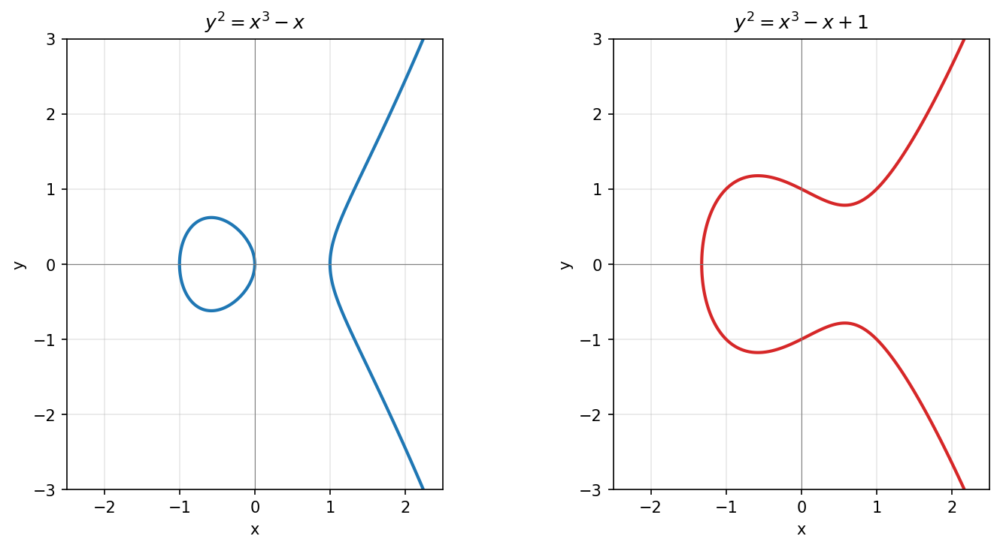
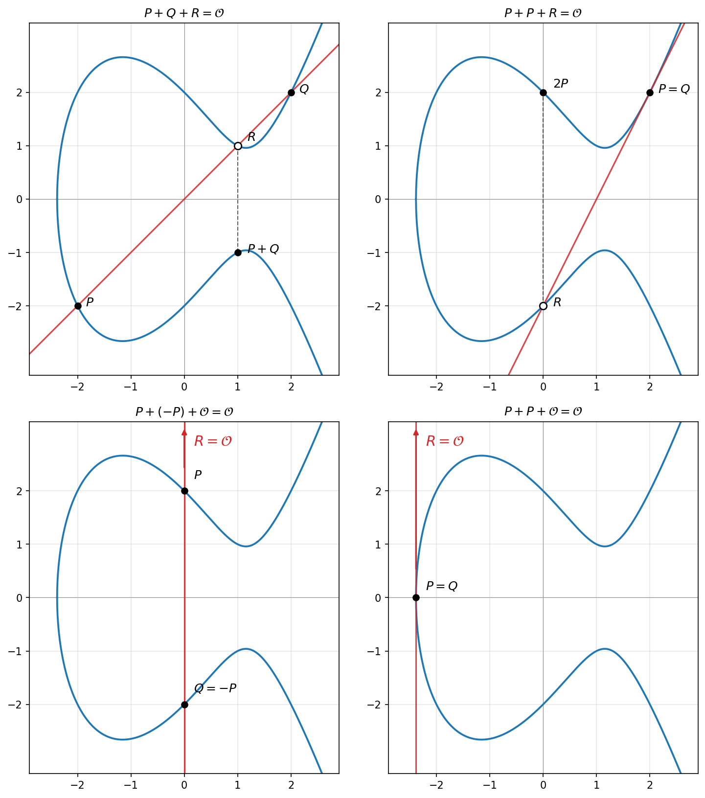
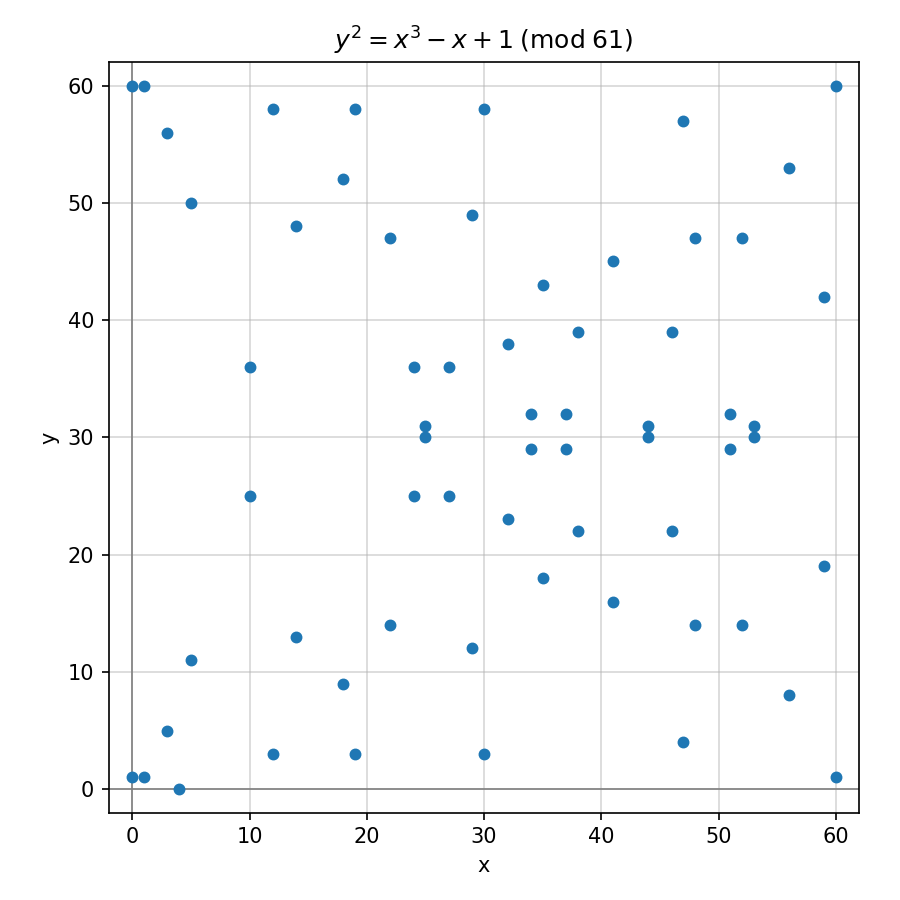

# Eliptičke krive

## Definicija problema

> Da li postoji bolji izbor grupe \\(G\\) od \\(\mathbb{Z}_p^*\\) u protokolima
> kriptografije javnog ključa zasnovaniom na problemu diskretnog logaritma?

Eliptičke krive nam daju potvrdan odgovor na prethodno pitanje.

## Eliptičke krive nad \\(\mathbb{R}\\)

Posmatrajmo za početak eliptičke krive u skupu realnih brojeva. To su krive
određene skupom tačaka koje ispunjavaju jednakost \\(y^2 = x^3 + ax + b\\), za
neke \\(a, b \in \mathbb{R}\\). Kako kriva ne bila degenerisana, potebno je da
važi \\(4a^3 + 27b^2 \neq 0\\).

Skup tačaka eliptičke krive \\(E\\) zadate pomenutom jednakošću označavamo sa
\\(E(\mathbb{R})\\). Pretpostavljamo da pored tačaka koje zadovoljavaju
pomenutu jednakost postoji i "beskonačno daleka tačka" \\(\mathcal{O}\\) (ovo
je posledica toga da eliptičku krivu zapravo definišemo u projektivnoj ravni).

~~~python
~~~

### Izvođenje Vajerštrasove forme

### Sabiranje tačaka

Na skupu tačaka \\(E(\mathbb{R})\\) možemo definisati operaciju sabiranja. Neka
su \\(P\\) i \\(Q\\) dve tačke na eliptičkoj krivoj. Prava kroz \\(P\\) i
\\(Q\\) seče krivu u nekoj trećoj tački \\(R\\). Sabiranje definišemo tako da
važi \\(P + Q + R = \mathcal{O}\\). Na slici su prikazana četiri različita
slučaja u zavisnosti od odnosa tačaka. U prvom slučaju su sve tri tačke
različite, u drugom je \\(P = Q\\), u trećem je \\(R = \mathcal{O}\\), a u
četvrtom je \\(P = Q\\) i \\(R = \mathcal{O}\\).

Na osnovu ovoga možemo izvesti formule za sabiranje tačaka na eliptičkoj
krivoj. Ako je \\(P = \mathcal{O}\\) onda je \\(P + Q = Q\\), a ako je \\(Q =
\mathcal{O}\\) onda je \\(P + Q = P\\). Drugim rečima, \\(\mathcal{O}\\) je
neutral za sabiranje tačaka.

Neka su date koordinate različitih tačaka \\(P: (x_P, y_P)\\) i \\(Q: (x_Q,
y_Q)\\). Ako je \\(x_P = x_Q\\), onda mora biti \\(y_P = -y_Q\\) (jer su tačke
različite), pa je \\(P + Q = \mathcal{O}\\). U suprotnom, računamo nagib prave
kroz \\(P\\) i \\(Q\\) kao \\(s = \frac{y_Q - y_P}{x_Q - x_P}\\). Za svaku tačku
na pravoj kroz \\(P\\) i \\(Q\\) važi \\(y - y_P = s(x - x_P)\\), a za svaku
tačku preseka sa krivom važi \\(y^2 = x^3 + ax + b\\). Zamenom prve jednačine u
drugu dobijamo jednačinu \\((sx - sx_P + y_P)^2 = x^3 + ax + b\\) po \\(x\\).
Ova jednačina ima tri rešenja (za tri tačke preseka) i njihove vrednosti su
\\(x_P\\), \\(x_Q\\) i \\(x_R\\). Po Vijetovim formulama važi \\(-(x_P + x_Q +
x_R) = -s^2\\). Kako je \\(P + Q = -R\\), koordinate zbira su \\(x_R = s^2 -
x_P - x_Q\\) i \\(y_R = -(s(x_R - x_P) + y_P)\\).

U slučaju da je \\(P = Q\\), \\(s\\) računamo kao nagib tangente na krivu u
tački \\(P\\). Ovo računamo diferenciranjem obe strane jednačine krive, odnosno
\\(\frac{d}{dx}y^2 = \frac{d}{dx}(x^3 + ax + b)\\). Dobijamo \\(2y
\frac{dy}{dx} = 3x^2 + a\\), odnosno \\(s = \frac{dy}{dx} = \frac{3x_P^2 +
a}{2y_P}\\).

~~~python
~~~

### Množenje skalarom

Na osnovu sabiranja možemo jednostavno definisati množenje tačke prirodnim
brojem. Izveli smo formule za \\(2P = P + P\\). Jasno je da onda možemo
izračunati i \\(3P = 2P + P\\), \\(4P = 3P + P\\), itd. Ako bismo na ovaj način
računali \\(nP\\), složenost bi bila \\(O(n)\\). Umesto ovoga, možemo primeniti
isti algoritam kao za efikasno stepenovanje, čija je složenost \\(O(\log n)\\).

~~~python
~~~

## Eliptičke krive nad \\(\mathbb{F}_q\\)

Eliptičke krive možemo definisati i nad konačnim poljem \\(\mathbb{F}_q\\) na
isti način, pri čemu su sve vrednosti iz \\(\mathbb{F}_q\\). Za razliku od
eliptičkih kriva nad realnim brojevima, eliptičke krive nad konačnim poljima
nemaju jasnu geometrijsku strukturu. Ovo ih čini pogodnim za upotrebu u
kriptografiji.

Poznato je da je broj tačaka \\(n\\) na eliptičkoj krivoj nad
\\(\mathbb{F}_q\\) ograničen sa \\(|n - (q + 1)| \leq 2\sqrt{q}\\). Ovaj
rezultat je poznat kao Haseova teorema.

Problem diskretnog logaritma na eliptičkim krivama je problem rešavanja
jednačine \\(xG = H\\) gde su \\(G, H \in E(\mathbb{F}_q)\\). Za razliku od
problema diskretnog logaritma u \\( \mathbb{Z}_p^* \\), najefikasniji algoritmi
za njegovo rešavanje imaju eksponencijalnu složenost \\(O(\sqrt{n})\\) gde je
\\(n\\) veličina grupe. Zbog ovoga, u \\(E(\mathbb{F}_q)\\) je moguće koristiti
znatno manje ključeve nego u \\(\mathbb{Z}_p^*\\).

## Enkodovanje poruke na eliptičkoj krivoj

Kako bismo koristili eliptičke krive u kriptografiji, potrebno je da imamo
način da preslikamo proizvoljnu poruku \\(m\\) u tačku na eliptičkoj krivoj, i
obrnuto. Prikazaćemo jedan od načina koje je opisao Koblic.

Pretpostavimo da radimo sa krivom \\(E(\mathbb{F}_p)\\) za prost broj \\(p\\)
takav da je \\(p \equiv 3 \mod 4\\). Neka je broj \\(m\\) poruka koju želimo da
enkodujemo. Uzmimo na primer \\(k = 1024\\) i posmatrajmo redom vrednosti
\\(x_i = km + i\\) za \\(0 \leq i < k\\). Tražimo prvu vrednost \\(x_i\\) takvu
da je \\(c_i = x_i^3 + ax_i + b\\) kvadrat u \\(\mathbb{F}_p\\). Na osnovu
Ojlerovog kriterijuma, \\(c_i\\) je kvadrat po modulu \\(p\\) ako i samo ako je
\\(c_i^{\frac{p-1}{2}} \equiv 1 \mod p\\). Ako je \\(c_i\\) kvadrat, onda
njegov koren možemo izračunati kao \\(y_i = c_i^{\frac{p+1}{4}} \mod p\\) (zato
što je onda \\(y_i^2 = (c_i^{\frac{p+1}{4}})^2 = c_i^{\frac{p+1}{2}} =
c_i^{\frac{p-1}{2}}c_i \equiv c_i \pmod p\\)), što nam daje tačku \\((x_i,
y_i)\\) na krivoj. Kako je polovina brojeva kvadrat u \\(\mathbb{F}_p\\), jako
je mala šansa da \\(c_i\\) nije kvadrat ni za jedno \\(i\\). Sa druge strane,
za datu tačku \\((x, y)\\) jednostavno određujemo poruku \\(m\\) kao \\(\lfloor
\frac{x}{k} \rfloor\\).

## Protokoli zasnovani na eliptičkim krivama

Kao javni parametar bilo kog protokola potrebno je odabrati eliptičku krivu nad
nekim konačnim poljem. Biraju se parametri \\(p\\) (koji određuje konačno polje)

### Generisanje ključeva

Generisanje ključeva funkcioniše kao i u do sada opisanim protokolima zasnovanim na problemu diskretnog logaritma.

### Validacija javnog ključa

### Difi-Helman razmena ključa

### ElGamal enkripcija

### ElGamal potpis

### Šnorov potpis

## Zadaci

U narednim zadacima, ukoliko nije drugačije naznačeno, koristi se kriva
*secp128r1* sa parametrima:

~~~python
p = 340282366762482138434845932244680310783
a = 340282366762482138434845932244680310780
b = 308990863222245658030922601041482374867
G = (29408993404948928992877151431649155974,
     275621562871047521857442314737465260675)
n = 340282366762482138443322565580356624661
~~~

### Zadatak 1

Implementirati klasu za rad sa tačkama eliptičke krive \\(y^2 = x^3 + ax + b\\)
nad konačnim poljem \\(\mathbb{F}_p\\). Implementirati operacije sabiranja
tačaka, oduzimanja, dupliranja i množenja skalarom korišćenjem efikasnog
algoritma složenosti \\(O(\log k)\\).

### Zadatak 2

Implementirati funkciju koja proverava da li je data tačka validan javni ključ
za zadate parametre eliptičke krive \\((p, a, b, G, n)\\). Funkcija treba da
proveri da je tačka različita od tačke u beskonačnosti, da leži na krivoj i da
pripada cikličnoj podgrupi reda \\(n\\) generisanoj sa \\(G\\).

### Zadatak 3

Implementirati Koblicovo enkodovanje koje preslikava poruku \\(m\\) u tačku na
eliptičkoj krivoj, kao i odgovarajuće dekodovanje.

### Zadatak 4

Implementirati protokol koji omogućava klijentu i serveru da ostvare šifrovanu
komunikaciju. Tajni ključ se uspostavlja ECDH razmenom. Nakon toga se
komunikacija nastavlja korišćenjem AES enkripcije za slanje poruka serveru.

### Zadatak 5

Ana i Boban izvršavaju ECDH razmenu ključa. Njihovi javni ključevi su:

~~~python
A = (38908903211101888278623563709835614940,
     86414223312395224141852774166062813584)
B = (210067491220345722062217915833545932319,
     314595414076388517941891137742153277344)
~~~

Eva kontroliše kanal i izvršava man-in-the-middle napad koristeći privatni ključ:

~~~python
e = 99327691616788894527576870712013829048
~~~

Odrediti zajedničke ključeve koje Eva deli sa Anom i Bobanom.

### Zadatak 6

Anin javni EC-ElGamal ključ je:

~~~python
A = (172555618972274937527774535265768735313,
     10081883194550683330255804375487986898)
~~~

Poznato je da se poruka enkodovana kao tačka:

~~~python
M = (258195427694994240236789828875940887457,
     337184816232937204958887835705857507231)
~~~

šifruje u:

~~~python
R1 = (70317932819526710602903815804549240940,
      36813546415559138349030471247361636124)
C1 = (287066134838516450567688517941084959058,
      218063401705308332321934229482059355773)
~~~

Odrediti poruku \\(M'\\) (kao tačku) čiji je šifrat:

~~~python
R2 = (70317932819526710602903815804549240940,
      36813546415559138349030471247361636124)
C2 = (33302374266159024897512879673930207502,
      336771186098399155523098592439895884956)
~~~

### Zadatak 7

Boban koristi EC-ElGamal potpis u kome se za preslikavanje tačke u skalar
koristi \\(\phi(R) = R_x \mod n\\). Bobanov javni ključ je:

~~~python
A = (1446342285746087496322261997989149864,
     51899882338286411277127986568238557735)
~~~

Poznate su poruke `m1 = "Hello, world!"` sa potpisom:

~~~python
R1 = (91407655570239612505893793489075498927,
      25538088875613710856623369771771322160)
s1 = 311396362683851534909632246027045848057
~~~

i `m2 = "Hello, matf!"` sa potpisom:

~~~python
R2 = (91407655570239612505893793489075498927,
      25538088875613710856623369771771322160)
s2 = 32731572252507648075677496446020975539
~~~

Odrediti privatni ključ.

### Zadatak 8

Boban koristi EC-Šnorov potpis u kome se izazov računa kao
\\(c = h(\text{"(R_x, R_y)"} \mathbin{||} m) \mod n\\) za heš funkciju
SHA-256. Bobanov javni ključ je:

~~~python
A = (109467063707252142941786888194056392558,
     283624804562688076124413520142906544564)
~~~

Poznate su poruke `m1 = "Zdravo, svete!"` sa potpisom:

~~~python
R1 = (69191772370633742414484574291592789683,
      150081736994045835000962439583877754103)
s1 = 275532418724142788316051765718430826437
~~~

i `m2 = "Vozdra, svete!"` sa potpisom:

~~~python
R2 = (69191772370633742414484574291592789683,
      150081736994045835000962439583877754103)
s2 = 22127400428374188013866090255927965142
~~~

Odrediti privatni ključ.

### Zadatak 9

Boban koristi EC-Šnorov potpis u kome se izazov računa samo na osnovu poruke,
bez vrednosti \\(R\\), kao \\(c = h(m) \mod n\\). Bobanov javni ključ je:

~~~python
A = (246691936285505052706352817197487175489,
     10886859581935478975083534919891668598)
~~~

Predstaviti se lažno kao Boban i poslati Ani potpisanu poruku
`m = "Vozdra, svete!"`.

### Zadatak 10

Implementirati protokol koji omogućava klijentu i serveru da ostvare šifrovanu
komunikaciju razmenom ECDH ključeva. Obezbediti da je protokol otporan na
man-in-the-middle napade korišćenjem EC-Šnorovog potpisa.

### Zadatak 11

Boban koristi ECDH protokol nad krivom \\(y^2 = x^3 + 1\\) nad poljem
\\(\mathbb{F}_p\\) sa parametrima:

~~~python
p = 1940158473524142299
n = 1940158473524142300
G = (17, 213329057279393933)
~~~

Bobanov javni ključ je:

~~~python
A = (1057509392935454215, 1290626223251531797)
~~~

Odrediti Bobanov privatni ključ.

### Zadatak 12

Boban je Ani ponudio nekoliko kandidata za parametre eliptičke krive
\\((p, a, b)\\) za upotrebu u ECDH protokolu. Odrediti koji su od ponuđenih
bezbedni:

~~~python
p1, a1, b1 = 501367, 183559, 261029
p2, a2, b2 = 1015009, 264169, 456192
p3, a3, b3 = 1606901, 1519467, 586263
p4, a4, b4 = 670487, 386126, 380490
~~~
