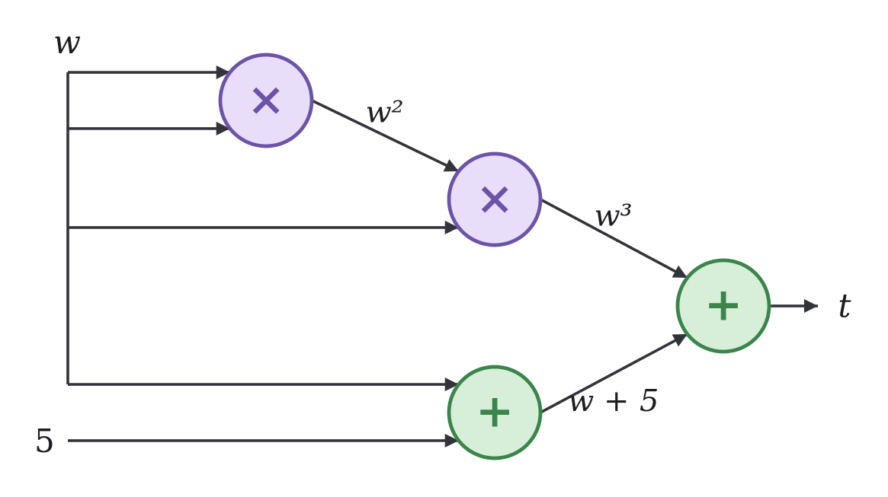

# Pregled modernih tema

## Uparivanja na eliptickim krivama

### Definicija uparivanja

Neka su \\(G_1\\) i \\(G_2\\) ciklične podgrupe prostog reda \\(q\\) grupa
tačaka na dve eliptičke krive, i neka je \\(G_T\\) multiplikativna grupa reda
\\(q\\). Uparivanje je funkcija \\(e\\) koja preslikava par tačaka iz \\(G_1\\)
i \\(G_2\\) u element iz \\(G_T\\) tako da važi bilinearnost, odnosno \\(e(aP,
bQ) = e(P, Q)^{ab}\\). Nećemo prikazati konkretne konstrukcije uparivanja, već
ćemo se fokusirati na njihove primene.

### BLS potpisi

Neka je tačka \\(Q\\) generator grupe \\(G_2\\). Tajni ključ se bira kao
slučajan broj \\(a \in \mathbb{Z}_q\\), a javni ključ se računa kao \\(A =
aQ\\). Potpis poruke \\(m\\) se računa kao \\(S = aH(m)\\) (pretpostavimo da
je funkcija \\(H\\) heš funkcija koja slika poruku u tačku grupe \\(G_1\\)).
Verifikacija potpisa se vrši proverom jednakosti \\(e(S, Q) = e(H(m), A)\\).

Jedno od značajnih svojstava BLS potpisa je da se više potpisa može agregirati
u jedan, što omogućava efikasnu verifikaciju velikog broja potpisa.

### KZG obavezivanje

KZG šema omogućava efikasno obavezivanje na polinome.

Neka su \\(P\\) i \\(Q\\) generatori grupa \\(G_1\\) i \\(G_2\\). Za početak,
neophodno je generisati tajni parametar \\(\tau\\) i iz njega izvesti javne
parametre \\(P, \tau P, \tau^2 P, \ldots, \tau^n P\\) za neko \\(n\\) i \\(Q,
\tau Q\\). Tajni podatak \\(\tau\\) niko ne sme da poznaje. Ovo je moguće
izvesti takozvanim *stepeni \\(\tau\\)* protokolom, koji funkcioniše po sličnom
principu kao protokoli za distribuirano generisanjem tajne, sa pretpostavkom da
je bar jedan od učesnika pošten i da je odbacio svoj doprinos tajnoj vrednosti.

Neka je \\(f(x) = a_0 + a_1 x + \ldots + a_d x^d\\) polinom stepena \\(d \leq
n\\) sa koeficijentima u \\(\mathbb{Z}_q\\). KZG obaveza na polinom \\(f\\) se
računa kao tačka \\(C_f = a_0 P + a_1 (\tau P) + \ldots + a_d (\tau^d P)\\),
odnosno \\(C_f = f(\tau) P\\).

Primetimo da bi za lažiranje obaveze bilo neophodno pronaći polinom \\(f' \neq
f\\) stepena najviše \\(n\\) takav da je \\(f'(\tau) = f(\tau)\\). Kako je
\\(\tau\\) nepoznato, jedini način da se to postigne je nagađanjem. Pošto je
stepen polinoma \\(f(x) - f'(x)\\) najviše \\(n\\), oni se mogu poklapati u
najviše \\(n\\) tačaka, pa je verovatnoća da se poklope u tački \\(\tau\\)
najviše \\(n/q\\), što je zanemarljivo za velike vrednosti \\(q\\) (obično je
\\(n\\) reda veličine ispod \\(30\\) bita, a \\(q\\) reda veličine \\(256\\)
bita).

KZG obaveze nam omogućavaju da dokažemo da je \\(f(z) = y\\) za neke vrednosti
\\(z\\) i \\(y\\) bez otkrivanja polinoma \\(f\\). Ako je zaista \\(f(z) =
y\\), onda je polinom \\(f(x) - y\\) deljiv sa \\(x - z\\) jer je \\(z\\) nula
polinoma \\(f(x) - y\\), pa definišemo \\(q(x)\\) tako da je \\(f(x) - y =
q(x)(x-z)\\). Dokaz da je \\(f(z) = y\\) je tačka \\(C_q = q(\tau) P\\) (KZG
obaveza na polinom \\(q\\)). Provera KZG dokaza se vrši ispitivanjem jednakosti
\\(e(C_f - yP, Q) = e(C_q, \tau Q - z Q)\\). Ako je zaista \\(f(z) = y\\), onda
važi \\(e(C_f - yP, Q) = e(P, Q)^{f(\tau) - y} = e(P, Q)^{q(\tau) (\tau - z)} =
e(C_q, \tau Q - z Q)\\).

Primetimo da su KZG obaveze i KZG dokazi konstantne veličine. Uporedimo to sa
Pedersenovim obavezama za polinome - neophodno je obavezati se na svaki
koeficijent polinoma.

## Dokazi sa nula znanja

U osmom poglavlju smo videli različite sigma protokole i njihove neinteraktivne
varijante (dokaze sa nula znanja). Za svaki problem bilo je potrebno osmisliti
poseban protokol. Ispostavlja se da je moguće konstruisati univerzalni protokol
za dokazivanje bilo kog NP tvrđenja sa nula znanja. Prikazaćemo, jednu takvu
konstrukciju, uz preskakanje ili pojednostavljivanje nekih tehničkih detalja.

Ako je problem \\(L\\) u \\(NP\\) onda postoji program polinomijalne vremenske
složenosti (tzv. verifikator) \\(V\\) takav da za ulaz \\(t\\) važi \\(t \in
L\\) ako i samo ako postoji svedok \\(w\\) takav da je \\(V(t, w) = 1\\). Na
primer, problem izomorfizma grafova je u NP zato što je moguće efikasno
proveriti da li se permutacijom čvorova jednog grafa pomoću permutacije \\(w\\)
dobija drugi graf. Cilj nam je da konstruišemo dokaz da poznajemo svedoka
\\(w\\) za neki ulaz \\(t\\) problema \\(L\\) bez otkrivanja bilo kakvih
informacija o svedoku.

### Aritmetizacija

Svaki program polinomijalne vremenske složenosti može se, za fiksiranu veličinu
ulaza \\(n\\), predstaviti kao aritmetičko kolo polinomijalne veličine u odnosu
na \\(n\\). Čvorovi kola predstavljaju operacije sabiranja i množenja u nekom
konačnom polju. Smatramo da su vrednosti i operacije definisane nad nekim
konačnim poljem \\(\mathbb{F}_p\\).

Jedan od alata koji omogućava pisanje programa kao aritmetičkih kola za potrebe
generisanja dokaza sa nula znanja je Circom.

### Tabela izvršavanja

Neka je NP problem definisan verifikatorom \\(V(t, w) \Leftrightarrow w^3 + w +
5 = t\\). Njegovo kolo je prikazano ispod.

Označimo levi ulaz čvora sa \\(a\\), desni ulaz sa \\(b\\), a izlaz sa \\(c\\).
Primetimo da bilo koju operaciju u kolu možemo predstaviti pomoću jednakosti
\\(q(a + b) + (1 - q)ab - c = 0\\). Množenje se dobija izborom \\(q = 0\\), a
sabiranje izborom \\(q = 1\\). Na osnovu ovoga možemo napraviti transkript
izvršavanja kola:

|\\(q\\)|\\(a\\)|\\(b\\)|\\(c\\)|
|---------|-------|-------|-------|
| \\(0\\) |\\(w\\)|\\(w\\)|\\(w^2\\)|
| \\(1\\) |\\(w\\)|\\(5\\)|\\(w+5\\)|
| \\(0\\) |\\(w^2\\)|\\(w\\)|\\(w^3\\)|
| \\(1\\) |\\(w^3\\)|\\(w+5\\)|\\(x\\)|

Ako, na primer, poznajemo svedoka \\(w = 2\\) za instancu \\(t = 15\\),
tabela izvršavanja izgleda ovako:

|\\(q\\)|\\(a\\)|\\(b\\)|\\(c\\)|
|---------|-------|-------|-------|
| \\(0\\) |\\(2\\)|\\(2\\)|\\(4\\)|
| \\(1\\) |\\(2\\)|\\(5\\)|\\(7\\)|
| \\(0\\) |\\(4\\)|\\(2\\)|\\(8\\)|
| \\(1\\) |\\(8\\)|\\(7\\)|\\(15\\)|

Primetimo da kolona \\(q\\) ne zavisi od svedoka, već je određena samo
strukturom kola i zavisi samo od problema koji se rešava.

### Svođenje na polinome

Neka izvršavanje ima \\(m\\) koraka. Odaberimo različite vrednosti \\(x_1,
\ldots, x_m\\) (možemo na primer odabrati vrednosti \\(1, 2, \ldots, m\\)).
Odredimo polinome \\(q(x), a(x), b(x), c(x)\\) tako da se vrednosti u tačkama
\\(x_1, \ldots, x_m\\) poklapaju sa vrednostima iz odgovarajuće kolone. Na
primer, za polinom \\(b(x)\\) treba da važi \\(b(1) = 2, b(2) = 5, b(3) = 2,
b(4) = 7\\) ukoliko smo odabrali \\(x_1 = 1, x_2 = 2, x_3 = 3, x_4 = 4\\).
Ove polinome možemo odrediti Lagranžovom interpolacijom.

Definišimo polinom \\(f(x) = q(x)(a(x) + b(x)) + (1 - q(x))a(x)b(x) - c(x)\\).
Primetimo da je \\(f(x_i) = 0\\) za svako \\(1 \leq i \leq m\\), što znači da
je \\(f(x)\\) deljiv polinomom \\(z(x) = (x - x_1) \ldots (x - x_m)\\), odnosno
\\(f(x) = h(x)z(x)\\) za neki polinom \\(h(x)\\).

Naglasimo da bi u pravoj konstrukciji takođe bilo neophodno enkodirati i
određene jednakosti između redova kao polinome. Na primer, potrebno je dokazati
da je \\(c(1) = a(3)\\) (oba su \\(w^2\\)). Ovo je moguće enkodovati polinomom
\\(l_1(x) (c(x) - a(x + 2))\\) gde je \\(l_1(x)\\) polinom takav da je
\\(l_1(1) = 1\\) i \\(l_1(i) = 0\\) za ostale tačke \\(i\\). Ovakve polinome
bi trebalo uključiti u definiciju polinoma \\(f(x)\\), za svaku jednakost
koju je potrebno dokazati.

### Dokaz

Dokazivač se obavezuje na polinome \\(a(x), b(x), c(x)\\) i \\(h(x)\\) KZG
obavezama. U interaktivnoj varijanti protokola, proveravač zatim bira slučajni
izazov \\(r\\). U neinteraktivnom dokazu, dokazivač koristi Fiat-Šamir
heuristiku da izvračuna \\(r\\) kao heš vrednost transkripta kompletnog
protokola do tog trenutka. Dokazivač koristi KZG dokaze da dokaže vrednosti
\\(a(r), b(r), c(r)\\) i \\(h(r)\\). Proveravač proverava da li važi \\(f(r) =
h(r)z(r)\\) i u slučaju da važi, zaključuje da je \\(f(x) = h(x)z(x)\\) sa
velikom verovatnoćom, odnosno da su operacije u kolu ispravno izvršene, odnosno
da dokazivač zaista poznaje validnog svedoka \\(w\\) za ulaz \\(t\\).

Jednakost je dovoljno proveriti u jednoj tački \\(r\\) jer, čak i da ne važi
jednakost celih polinoma, polinom \\(f(x) - h(x)z(x)\\) je ograničenog stepena
\\(n\\), što znači da je verovatnoća da dokazivač koji pokušava da lažira dokaz
može da namesti jednakost baš u tački \\(r\\), koju ne zna unapred, najviše
\\(n / p\\) što je zanemarljivo za velike vrednosti \\(p\\).

Bez obzira na veličinu početnog problema, veličina dokaza je konstantna i
provera je veoma efikasna.

## Kvantna otpornost

Kvantni računari su nov tip računara koji se oslanja na upotrebu kvantnih
bitova, odnosno kubita, koji za razliku od klasičnih bitova mogu da budu u
superpoziciji stanja. Zbog toga se mogućnosti kvantnih računara fundamentalno
razlikuju od klasičnih računara. Jedna posledica je da za određene probleme
postoje kvantni algoritmi kjoi su značajno efikasniji od najboljih poznatih
klasičnih algoritama.

Bitno je naglasiti da trenutno ne postoje kvantni računari koji mogu pouzdano
da izvršavaju kvantne algoritme nad velikim brojem kubita. Sa druge strane, ovo
je veoma aktivna oblast istraživanja i nije nemoguće da će se to promeniti u
narednoj deceniji.

### Groverov algoritam

Neka je data funkcija \\(h\\) (npr. neka heš funkcija) i neka je data vrednost
\\(y\\). Potrebno je odrediti vrednost \\(x\\) tako da važi \\(h(x) = y\\).
Najbolji poznati klasični algoritmi za rešavanje ovog problema imaju vremensku
složenost \\(O(n)\\), gde je \\(n\\) veličina prostora pretrage. *Groverov
algoritam* omogućava rešavanje ovog problema u vremenskoj složenosti
\\(O(\sqrt{n})\\).

To znači da je određivanje inverzne slike heš funkcije značajno efikasnije na
kvantnim računarima. Na primer, ako heš funkcija ima 128-bitni izlaz, klasični
algoritam bi zahtevao \\(2^{128}\\) koraka, dok bi Groverov algoritam
zahtevao samo \\(2^{64}\\) koraka. Način da se održi kvantna otpornost je da
se koriste heš funkcije sa dužim izlazom. Ako se koristi heš funkcija sa
256-bitnim izlazom, kvantni algoritam bi zahtevao \\(2^{128}\\) koraka, što
je isto kao i klasični algoritam sa 128-bitnim izlazom.

### Šorov algoritam

*Šorov algoritam* omogućava rešavanje problema faktorizacije, kao i problema
diskretnog logaritma u bilo kojoj konačnoj cikličnoj grupi u polinomijalnom
vremenu. Problem faktorizacije broja \\(n\\) može se rešiti u vremenskoj
složćenosti \\(O(\log^3 n)\\) na kvantnom računaru. Problem diskretnog logarima
u grupi \\(G\\) može se rešiti u vremenskoj složenosti \\(O(\log |G|)\\) na
kvantnom računaru.

Ovi rezultati su katastrofalni za sve protokole koji se oslanjaju na težinu
ovih problema, čak i bez obzira na izbor grupe (ni eliptičke krive ne pomažu).
Zbog toga je neophodno pronaći druge klase problema koji su teški i za klasične
i za kvantne računare.

### Lamportov potpis

Lamportov potpis se oslanja na upotrebu kriptografskih heš funkcija za kvantnu
otpornost. Neka je \\(h\\) heš funkcija sa izlazom dužine \\(n\\).

Privatni ključ se generiše kao niz od \\(n\\) parova slučajnih vrednosti
\\((x_i, y_i)\\), pri čemu je svaka vrednost dužine \\(n\\) bitova. Javni ključ
je niz parova \\(h(x_i), h(y_i)\\).

Potpisivanje poruke \\(m\\) se vrši tako što se posmatraju bitovi vrednosti
\\(h(m)\\). Ako je bit na \\(i\\)-toj poziciji jednak 0, objavljuje se vrednost
\\(x_i\\), a ako je bit jednak 1, objavljuje se vrednost \\(y_i\\).

Provera potpisa se vrši tako što se proverava da li je heš objavljene vrednosti
(\\(h(x_i)\\) ili \\(h(y_i)\\)) jednak odgovarajućem delu javnog ključa, u
zavisnosti od bitova vrednosti \\(h(m)\\).

Primetimo da su ključevi za ovaj potpis veliki. Na primer, ako je \\(n =
256\\), onda je veličina privatnog i javnog ključa po \\(2 \cdot 256 \cdot
256\\) bitova, odnosno 16 kilobajta.

Primetimo, takođe, i da su ključevi jednokratni, odnosno da nam omogućavaju da
potpišemo samo jednu poruku. To je zato što sam potpis zahteva da otkrijemo deo
privatnog ključa, pa bi bilo nebezbedno koristiti isti par ključeva za
potpisivanje više poruka. Jedan način da se ovo reši je upotrebom Merkle stabla.

## Zadaci

### Zadatak 1

Grupa potpisnika pravi agregirani BLS potpis poruke sa zajedničkim ključem \\(A =
\sum_i A_i\\). Pridružujete se poslednji i znate javne ključeve ostalih
učesnika. Namestiti svoj ključ tako da samostalno možete da proizvedete validan
multipotpis cele grupe za proizvoljnu poruku, a zatim predložiti odbranu.

~~~python
others = [(3253197710747319552652331051736, 2600547458541519107537085876347),
          (493875947817263770200857539721, 1005457789544420329373492633801),
          (4398077327025274074111996186478, 4032416314574447102788999321266),
          (2488539465432787523312532108876, 633500602060898915500471203495)]
~~~

### Zadatak 2

Pri generisanju KZG parametara procurela je tajna vrednost \\(\tau\\). Data je
obaveza \\(C_f\\) na nepoznat polinom stepena najviše \\(n\\). Koristeći
\\(\tau\\), napraviti dokaz da je \\(f(5) = 1337\\) (netačno).

~~~python
tau = 808125594869607863673393924924
n = 8
C_f = (1740596318257679078439504556029, 797403434159898836096510084702)
~~~

### Zadatak 3

Date su KZG obaveze \\(C_f\\) i \\(C_g\\) na dva nepoznata polinoma i dokazi
vrednosti \\(f(z)\\) i \\(g(z)\\). Napraviti jednu obavezu i jedan dokaz za
vrednost \\((f+g)(z)\\).

~~~python
g2 = ((3123222405771183912285272371589, 889621347109211773105306626444),
      (1389351266281089382217769713980, 4556896886183083855860660768016))
C_f = (4872578499853521075576471873043, 42371335861733313678048266075)
C_g = (3630176008658098532381820265258, 3287681829933959978674934358289)
z = 9
y_f = 147037695731468139483416602607
proof_f = (3925170666202618525851650522922, 2459568489448151586144483654368)
y_g = 988119221372610424591420477780
proof_g = (1947971255417175390759950296149, 5039343611747766020383206342099)
~~~

### Zadatak 4

Posmatrajmo pojednostavljenu konstrukciju dokaza iz lekcije u kojoj se proverava
samo jednačina kola u svakom redu tabele izvršavanja, ali ne i jednakosti između
redova. Za kolo \\(w^3 + w + 5 = t\\), napraviti tabelu izvršavanja koja
zadovoljava sve jednačine kola ali dokazuje netačno tvrđenje, a zatim navesti
koje su jednakosti između redova neophodne da se takav napad spreči.

### Zadatak 5

Isti par Lamportovih ključeva iskorišćen je za potpisivanje više poruka (javni
ključ i potpisi su u datoteci `zadatak5_data.py`). Sklopiti validan potpis
poruke „Kvantni pozdrav!”. Koliko bita izlaza heš funkcije je potrebno da bi
šema bila otporna na Groverov algoritam na nivou bezbednosti od 128 bita?
