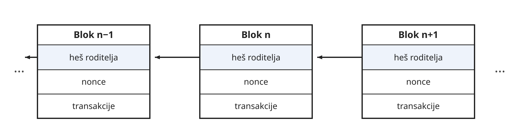
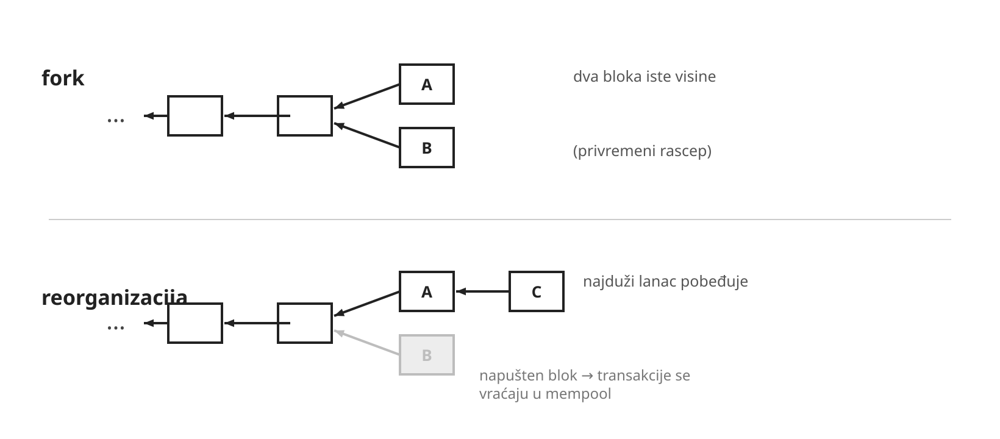
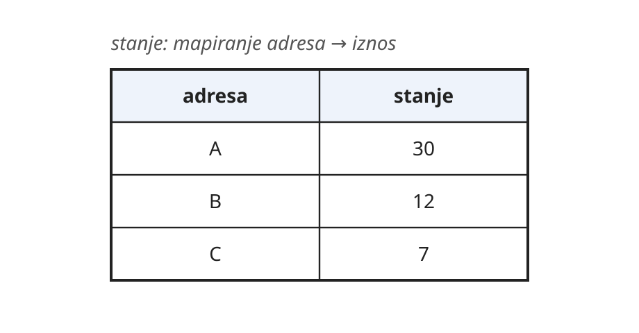
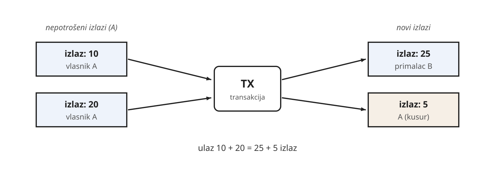
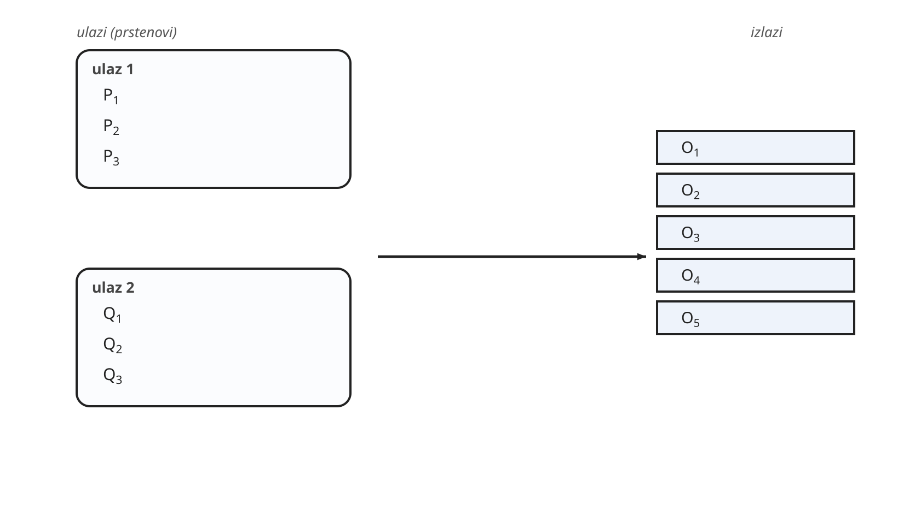
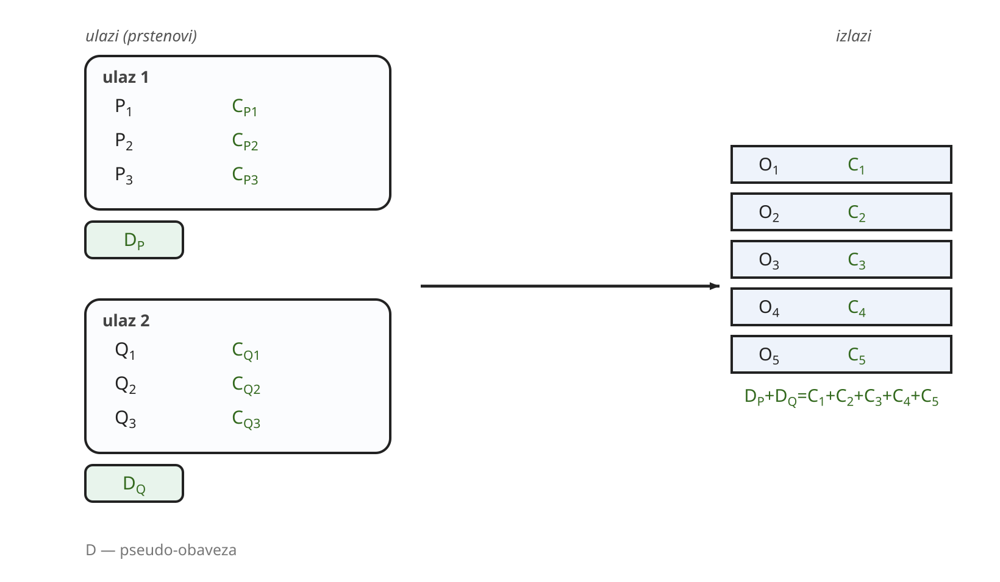
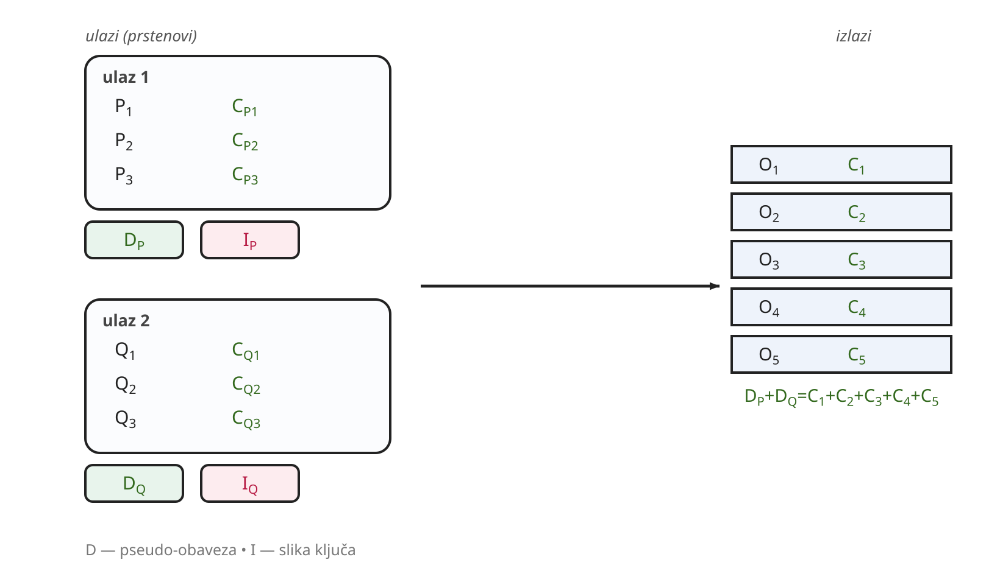

# Primena kriptografije u blokčejnu

## Opis problema

> Dizajnirati sistem za vođenje evidencije o monetarnim transakcijama (npr. Ana
> šalje Bobanu 3000 dinara) koji ne zavisi ni od jednog centralnog autoriteta
> kome je neophodno verovati.

Blokčejn je distribuirani sistem koji omogućava da grupa međusobno
nepoverljivih učesnika vodi zajedničku evidenciju o izvršenim transakcijama.
Ukratko, *blokčejn mreža* je peer-to-peer mreža u kojoj svaki čvor održava svoj
lanac blokova, tj. *blokčejn*. Blok je struktura koja sadrži spisak
transakcija. Čvorovi u mreži se dogovaraju o tome koji lanac je ispravan, što
znači da pod normalnim okolnostima svi čvorovi vide isti lanac blokova.

## Blokčejn

### Blok i lanac blokova

Blok je struktura koja sadrži spisak izvršenih transakcija, kao i još neka
polja neophodna za funkcionisanje blokčejna. Jedno od tih polja je heš
prethodnog bloka (roditelja). Heš bloka se računa kao heš svih njegovih polja.
Postoje dve važne posledice ovoga. Prva je da je na ovaj način definisan
poredak (lanac) među blokovima. Druga je da za bilo koji lanac možemo da
proverimo da li je validan tako što redom proveravamo poklapanje heševa. Ako
postoji nepoklapanje, smatramo da je lanac neispravan i odbacujemo ga.

Ukoliko korisnik želi da mu transkacija bude uključena u blokčejn, šalje je
jednom od čvorova u mreži. Čvor dalje propagira transakciju ostatku mreže.
Svaki čvor održava spisak transakcija (*mempool*) koje još nisu uključene u
blokčejn. Kada čvor odluči da predloži novi blok mreži, upisuje transakcije iz
svog spiska u blok zajedno sa hešom poslednjeg bloka iz svog lanca i šalje
predlog bloka ostatku mreže. Mi ćemo u nastavku pretpostaviti da se umesto samo
novog bloka šalje ceo novi lanac jer to pojednostavljuje neke detalje. U
praksi, ako je nekom čvoru u mreži potreban deo lanca pored predloženog bloka,
on to može zatražiti od čvora koji je poslao predlog.

### Kopanje blokova i dokaz o radu

Potrebno je napraviti mehanizam koji omogućava mreži da se složi oko toga koji
od validnih lanaca je kanonski. Zbog ovoga se uvodi koncept "dokaza o radu".
Ideja je da predlaganje novog bloka bude u nekoj meri "skupa" operacija.
Definiše se težina rada \\(d\\) koja određuje sa koliko bitova nule mora da
počinje heš predloženog bloka. Primetimo da je, pod pretpostavkama
kriptografskih heš funkcija, jedin način da se ovakva heš vrednost efektivno
odredi korišćenjem brute-force pristupa. Jedno od polja u bloku je prirodan
broj `nonce` i čvor koji predlaže blok, nakon popunjavanja ostalih polja,
pokušava da namesti vrednost `nonce` polja tako da heš bloka ispunjava
prethodno pomenut uslov, redom pokušavajući vrednosti 0, 1, 2, itd. Očekivani
broj pokušaja je \\(2^d\\). Ovaj proces se naziva "kopanje" blokova.

Kanonski lanac se onda bira kao validan lanac sa najvećim ukupnim radom (koji
računamo kao \\(\sum_{block} 2^{d_{block}}\\)), ili ekvivalentno (ako je težina ista za svaki
blok) kao najduži validan lanac. Sa ovakvim pravilom, dokle god pošteni čvorovi
zbirno poseduju većinu ukupne računske snage u mreži, biće održan ispravan
kanonski lanac.

Primetimo da se može desiti da dva čvora skoro istovremeno iskopaju različite
blokove. To znači da će različiti delovi mreže videti različite kanonske lance
u istom trenutku, ali ovo će se razrešiti samo od sebe kako se kopanje
nastavlja, jer će jedan od ta dva lanca ubrzo postati duži sa velikom
verovatnoćom. U tom slučaju, potrebno je transakcije koje su iskopane u
izgubljenom bloku vratiti u mempool. Ovakav događaj nazivamo reorganizacijom
blokčejna. Zbog ovakvih situacija, transakcija se smatra konačnom tek nakon što
je posle nje iskopan određen broj blokova.

Primetimo i da je promena istorije blokčejna veoma skupa operacija. Ako bi neko
želeo da promeni neki blok sto blokova unazad, morao bi ponovo da iskopa svih
narednih sto blokova i da pretekne trenutni najduži lanac. Zbog ovoga, blokčejn
je praktično nepromenljiv.

### Transakcije i stanje

Svaka blokčejn mreža ima svoju fiktivnu valutu. Svaki čvor održava trenutno
stanje koje oslikava koliko koji korisnik ima novca, a koje je posledica
izvršavanja svih transakcija sa svih blokova od početka do kraja lanca.
Korisnik se poistovećuje sa svojim javnim ključem, a stanje se vodi po adresama
koje su izvedene iz javnih ključeva.

Jedan pristup održavanju stanja je da se vodi evidencija o računu svakog
korisnika, odnosno da se održava mapiranje iz adrese u vrednost izraženu u
valuti blokčejna (ovo je npr. pristup koji koristi Ethereum).

U nastavku teksta ćemo se fokusirati na drugi pristup (koji koristi Bitcoin).
Ovaj pristup održava skup nepotrošenih izlaza transakcija (eng. *unspent
transaction outputs*, UTXO). Transakcija ima skup ulaza (nepotrošenih izlaza iz
prethodnih transakcija) i skup novih izlaza, pri čemu svaki izlaz ima adresu i
iznos. Na primer, ako korisnik A ima dva nepotrošena izlaza sa iznosima 10 i
20, a želi da izvede prenos u iznosu od 25 korisniku B, on troši oba svoja
izlaza i kreira dva nova izlaza, jedan za korisnika B sa iznosom 25 i jedan za
sebe sa kusurom u iznosu 5.

Transakcija je validna ako su svi njeni ulazi validni (postoje u skupu
nepotrošenih izlaza) i ako je zbir iznosa ulaza jednak zbiru iznosa izlaza.
Takođe, neophodno je da uz svaki ulaz bude priložen i potpis heša svih ulaza i
izlaza transakcije, koji odgovara njegovom javnom ključu.

Primetimo da je neophodno da poruka koju potpisujemo obuhvati i izlaze, jer bi
u suprotnom napadač mogao da vidi tuđu potpisanu transakciju koja još uvek nije
uključena u blokčejn, iskopira potpisane ulaze i podnese novu transakciju koja
preusmerava novac sa tih ulaza sebi.

Napomenimo i da je u oba slučaja jedini način za stvaranje novog novca na
blokčejnu kroz kopanje blokova. Inicijalno stanje ne sadrži nikakav balans u
slučaju prvog modela, odnosno nikakve nepotrošene izlaze u slučaju drugog
modela. Kopanje bloka sa sobom nosi određenu nagradu, čime je moguće uvećati
ukupnu količinu valute, a pritom služi i kao podsticaj čvorovima u mreži da
učestvuju u kopanju blokova.

<!--
### Merkle stablo

Blok obično sadrži više transakcija, a u zaglavlju želimo jednu kratku vrednost
koja se obavezuje na sve njih, tako da heš zaglavlja jednoznačno određuje ceo
skup transakcija. Pri tome bi bilo korisno da „laki” klijent, koji ne čuva ceo
lanac, može da proveri da je određena transakcija u bloku, a da ne preuzima sve
ostale. Oba zahteva ispunjava *Merkle stablo*, sa kojim smo se već sreli uz
Lamportov potpis u desetom poglavlju.

Merkle stablo gradimo tako što transakcije (njihove heševe) postavimo kao listove,
pa zatim parove čvorova spajamo heširanjem dok ne ostane jedan čvor — *koren*. Ako
je broj čvorova na nekom nivou neparan, poslednji čvor dupliramo.

~~~python
def merkle_root(leaves):
    level = [h(leaf) for leaf in leaves]
    while len(level) > 1:
        if len(level) % 2:
            level.append(level[-1])
        level = [h(level[i], level[i + 1]) for i in range(0, len(level), 2)]
    return level[0]
~~~

Da bismo dokazali da se neki list nalazi u stablu, dovoljno je priložiti susede
duž putanje od lista do korena. Proveravač tom putanjom ponovo izračunava
heševe naviše i upoređuje rezultat sa korenom. Veličina ovog dokaza je
logaritamska u odnosu na broj transakcija.

~~~python
def verify_proof(root, leaf, path):
    node = h(leaf)
    for sibling, right in path:
        node = h(sibling, node) if right else h(node, sibling)
    return node == root
~~~

Primetimo da dupliranje poslednjeg čvora nije bezazleno: liste transakcija
\\([A, B, C]\\) i \\([A, B, C, C]\\) daju isti koren. Ovo je bila stvarna ranjivost
u Bitkoinu (CVE-2012-2459) i pokazuje da i naizgled sporedne odluke u konstrukciji
mogu imati bezbednosne posledice. U praksi se zato fiksira broj transakcija i
domenski razdvajaju heševi listova i unutrašnjih čvorova.

Time je transparentni blokčejn zaokružen: imamo lanac blokova povezan dokazom
rada, mrežu koja se slaže oko najdužeg lanca, i transakcije čije vlasništvo
štite digitalni potpisi. Sve je, međutim, potpuno javno.
-->

## Anonimnost

Na prethodno opisanim javnim lancima (npr. Bitcoin, Ethereum) sve transakcije
su javno dostupne i poznate čitavoj mreži, uključujući i iznose i adrese
pošiljalaca i primalaca. U nastavku ćemo opisati jedan pristup (koji koristi
Monero) koji omogućava sakrivanje svih ovih informacija.

### Skrivene adrese

Prikažimo prvo način kojim možemo sakriti primaoca u transakciji. Ideja je da
se umesto direktnog transfera novca na adresu primaoca koriste jednokratne,
skrivene (eng. stealth) adrese. U javnom UTXO blokčejnu, jedan izlaz transakcije
je par \\(B, v\\) javnog ključa primaoca i iznosa.

Pretpostavimo da je \\(G\\) generator ciklične grupe nad kojom su generisani
parovi ključeva (koristimo aditivnu notaciju, kao kod eliptičkih krivih). Neka
je javni ključ primaoca \\(B = bG\\). Pošiljalac bira slučajno \\(t\\),
objavljuje \\(R = tG\\) i računa jednokratnu Difi-Helman tajnu \\(s = h(tB)\\)
(gde je \\(h\\) heš funkcija). Jednokratni javni ključ izlaza je \\(P = sG +
B\\). Primalac računa Difi-Helman tajnu kao \\(s = h(bR)\\) i računa
jednokratni tajni ključ \\(p = s + b\\). Proverava da li je \\(P = pG\\) i ako
jeste zna da je on primalac. Primetimo da bez poznavanja originalnog privatnog
ključa \\(b\\) nije moguće odrediti \\(p\\) i nije moguće povezati javni ključ
\\(P\\) sa javnim ključem \\(B\\). Dakle, izlaz transakcije je umesto para
\\(B, v\\) sada trojka vrednosti \\(R, P, v\\).

### Sakrivanje iznosa

Postoje dva uslova koja je neophodno ispuniti prilikom skrivanja iznosa. Jedan
je taj da jedino pošiljalac i primalac mogu (i moraju) da znaju iznos izlaza
transakcije. Drugi je taj da mora biti moguće proveriti da li je zbir ulaznih
vrednosti transakcije jednak zbiru izlaznih vrednosti.

Kako bismo ispunili prvi uslov, možemo se osloniti na simetričnu enkripciju.
Videli smo da prilikom skrivanja adrese pošiljalac i primalac vrše Difi-Helman
razmenu da generišu tajnu vrednost \\(s\\) koju jedino oni znaju. To znači da
je moguće zameniti iznos \\(v\\) njegovim šifratom \\(E_s(v)\\) u izlazu
transakcije.

Primetimo da na ovaj način ne bi bilo moguće proveriti jednakost zbirova ulaza
i izlaza transakcije. Kako bismo ispunili drugi uslov, pored šifrata za svaki
izlaz možemo uključiti i Pedersenovu obavezu na \\(v\\). Neka je \\(H\\) drugi
generator ciklične grupe. Pedersenovu obavezu \\(C_{v, r} = vG + rH\\) čuvamo u
sklopu svakog izlaza, zajedno sa \\(E_s(v, r)\\) (umesto samo \\(E_s(v)\\)).
Dakle, izlaz postaje četvorka vrednosti \\(R, P, C_{v, r}, E_s(v, r)\\).

Pretpostavimo sada da korisnik želi da napravi transakciju koja troši izlaz
\\(C_{v, r}\\) i pravi dva nova izlaza \\(C_{v_1, r_1}\\) i \\(C_{v_2, r_2}\\)
takva da je \\(v = v_1 + v_2\\). Kako poznaje ulaze \\(v\\) i \\(r\\), može da
odabere Pedersenove obaveze tako da važi \\(C_{v, r} = C_{v_1, r_1} + C_{v_2,
r_2}\\). Konkretno, \\(r_2\\) bira slučajno i računa \\(r_1 = r - r_2\\). Tada
važi \\(C_{v_1, r_1} + C_{v_2, r_2} = (v_1G + r_1H) + (v_2G + r_2H) = (v_1 +
v_2)G + (r_1 + r_2)H = vG + rH = C_{v, r}\\). Dakle, proverom \\(C_{v, r} =
C_{v_1, r_1} + C_{v_2, r_2}\\) bilo ko može da validira da je zbir ulaza jednak
zbiru izlaza, bez da zna vrednosti ulaza i izlaza. Primetimo da se ovaj
postupak lako uopštava na proizvoljan broj ulaza i izlaza.

Naglasimo da je ovde izostavljen jedan važan detalj. Primera radi, neka je data
transakcija koja troši izlaz u iznosu od \\(10\\) i pravi dva izlaza u iznosima
\\(10000\\) i \\(17\\). Jasno je da ovakva transakcija nije validna, ali ako
posmatramo Pedersenove obaveze u grupi reda 10007, jednakost Pedersenovih
obaveza se svodi na proveru da li je \\(10 \equiv 10000 + 17 \pmod{10007}\\),
što jeste tačno. Rešenje je onda dokazati da su sve obavezane vrednosti u nekom
dozvoljenom opsegu. Na kraju poglavlja ćemo prikazati jedan način da se ovakvo
svojstvo dokaže.

Napomenimo i da se vrednost nagrade za kopanje bloka ne mora skrivati i da ne
utiče značajno na prethodnu konstrukciju, pa je nećemo dalje obrađivati.

### Čaum-Pedersen dokaz

U nastavku ćemo prikazati dva sigma protokola koji su nam potrebni da opišemo
skrivanje pošiljaoca.

Opišimo sigma protokol kojim je moguće dokazati poznavanje istovremenog rešenja
za dva (ili više) problema diskretnog logaritma. Neka znamo \\(x\\) takvo da je
\\(A = g^x\\) i \\(B = h^x\\). Protokol se efektivno svodi na istovremeno izvršavanje
Šnorovog protokola za svaki problem diskretnog logaritma:

1. Dokazivač bira slučajno \\(r\\) i obavezuje se na njega sa \\(R_1 = g^r\\) i
   \\(R_2 = h^r\\).
2. Proveravač šalje izazov \\(c\\).
3. Dokazivač šalje \\(s = r + cx\\). Ispitivač proverava \\(g^s = R_1 A^c\\) i
   \\(h^s = R_2 B^c\\).

Jasno, Fiat-Šamir transformacijom se dobija neinteraktivan dokaz.

### ILI-dokaz

Podsetimo se činjenice da je bilo koji sigma protokol jednostavno lažirati
ukoliko nam je omogućeno da sami podesimo izazov i pre bilo kakvog
obavezivanja. Ovaj postupak se naziva simulacijom sigma protokola. Na primer,
Šnorov dokaz je moguće simulirati tako što se izazov \\(c\\) i vrednost \\(s\\)
slučajno generišu, a zatim se podesi \\(R = g^sA^{-c}\\).

Opišimo sada opšti sigma protokol kojim je moguće dokazati poznavanje rešenje
za bar jedan od nekih \\(n\\) problema Suština protokola je da proveravač koji
šalje izazov \\(c\\) očekuje da dobije po jedan validan dokaz za svaki problem,
ali da dokazivač može da bira izazove \\(c_1, \ldots, c_n\\) koje koristi u
dokazima. Jedini uslov koji ti izazovi moraju da ispune je da je \\(c_1 +
\ldots + c_n = c\\). To znači da dokazivač može da simulira sve osim jednog
dokaza, a za taj jedan problem gde poznaje rešenje mora da koristi izazov koji
ne može da namesti unapred. Na primer, ako dokazivač zna rešenje prvog
problema, u njemu koristi izazov \\(c_1 = c - c_2 - \ldots - c_n\\), dok su
\\(c_2, \ldots, c_n\\) unapred namešteni radi simulacije.

Posmatrajmo kako ILI-dokaz možemo primeniti da dokažemo da smo vlasnik jednog
od dva javna ključa na eliptičkoj krivoj. Neka su dati javni ključevi \\(A\\) i
\\(B\\) i neka znamo \\(A = aG\\). ILI-dokaz izgleda ovako:

1. Simuliramo dokaz za \\(B\\), odnosno biramo slučajno \\(s_2\\) i \\(c_2\\) i
   računamo \\(R_2 = s_2G - c_2B\\). Generišemo slučajno \\(r\\) i računamo \\(R_1 = rG\\).
   Objavljujemo \\(R_1\\) i \\(R_2\\).
2. Dobijamo izazov \\(c\\).
3. Računamo \\(c_1 = c - c_2\\) i zatim \\(s_1 = r + a c_1\\). Objavljujemo
   \\(s_1, c_1, s_2, c_2\\). Proveravač proverava \\(c = c_1 + c_2\\), \\(s_1G
   = R_1 + c_1 A\\) i \\(s_2 G = R_2 + c_2 B\\).

Fiat-Šamir transformacijom se dobija neinteraktivan dokaz.

### Sakrivanje pošiljaoca

Primetimo da sakrivanje primaoca transakcije već prilično krije identitete i
ponašanje učesnika u mreži. Kada primalac želi da potroši neki izlaz (odnosno
kada je on u ulozi pošiljaoca), transakciju potpisuje jednokratnim privatnim
ključem. Primetimo da to znači da skoro niko na mreži ne može da poveže taj
potpis sa njegovim originalnim javnim ključem. Ipak, ako je Ana Bobanu poslala
taj iznos, i sada ga Boban troši, Ana će znati kada je taj iznos koji je
poslala Bobanu potrošen. Takođe, primetimo da je tok novca i dalje potpuno
vidljiv celoj mreži, odnosno jasno je iz kojih ulaza su nastali koji izlazi i
vidi se kompletan graf izvršenih transakcija.

Kako bismo zakrpili i ove rupe, uvešćemo dodatno skrivanje pošiljaoca i
potrošenih ulaza. Jednostavnosti radi, pretpostavimo da imamo transakciju sa
jednim ulazom. Podsetimo se da je ulaz (nepotrošeni izlaz) identifikovan
jednokratnim javnim ključem \\(P\\) i da je transakcija potpisana odgovarajućim
jednokratnim tajnim ključem \\(p\\). Umesto ovoga, moguće je navesti veći broj
nepotrošenih izlaza kao ulaz u transakciju sa javnim ključevima \\(P_1, \ldots,
P_n\\), od kojih je samo jedan pravi ulaz koji se troši. Umesto potpisa je
moguće priložiti neinteraktivan ILI-dokaz koji dokazuje poznavanje tajnog
ključa za jedan od tih \\(n\\) nepotrošenih izlaza.

Na primer, za transakciju sa dva ulaza i pet izlaza, gde u svakom prstenu
koristimo po dva lažna i jedan pravi ulaz, pošiljalac za \\(P\\) dokazuje da
zna \\(p\\) tako da je \\(P_i = pG\\) za neko \\(i\\), bez otkrivanja
\\(i\\). Analogno, za \\(Q\\) dokazuje da zna \\(q\\) tako da je
\\(Q_j = qG\\) za neko \\(j\\), bez otkrivanja \\(j\\).

Da bi ovakav pristup funkcionisao, potrebno je da bude moguće dokazati da je
vrednost trošenog ulaza jednaka zbiru vrednosti izlaza. Ovo nije bio problem
pre skrivanja ulaza. Sada, kada umesto jednog pravog ulaza koji se troši imamo
spisak ulaza sa obavezama na vrednosti \\((P_1, C_{v_1, r_1}), \ldots, (P_n,
C_{v_n, r_n})\\), pored poznavanja tajnog ključa za jedan od ulaza potrebno je
dokazati i da će se zaista njegov iznos koristiti.

Uvodi se takozvana pseudo-obaveza \\(D_{v, r}\\) na pravu vrednost ovog ulaza i
ona se koristi prilikom validacije jednakosti zbirova ulaza i izlaza. Potrebno
je onda, dodatno, dokazati da pored toga što znamo tajni ključ za jedan od
ulaza (npr. za ulaz sa indeksom \\(i\\)), da važi i \\(v_i = v\\). Primetimo da
u tom slučaju važi \\(C_{v_i, r_i} - D_{v, r} = (v_i - v)G + (r_i - r)H
= (r_i - r)H = C_{0, r_i - r}\\). Drugim rečima, dokazujemo da je \\(C_{v_i,
r_i} - D_{v, r} = (r_i - r)H\\) obaveza na \\(0\\) i da znamo rešenje
diskretnog logaritma \\(r_i - r\\). Ovo se izvodi Šnorovim dokazom. Dakle,
ILI-dokaz treba da dokaže da, za jedan od \\(n\\) ulaza, poznajemo odgovarajući
tajni ključ, kao i da za isti taj ulaz znamo \\(r_i - r\\).

Bilo ko može da proveri da je \\(D_P + D_Q = C_1 + C_2 + C_3 + C_4 + C_5\\).
Pošiljalac za \\(P\\) dokazuje da zna \\(p\\) tako da je \\(P_i = pG\\)
i da se \\(C_{P_i}\\) i \\(D_P\\) obavezuju na istu vrednost, za neko
\\(i\\), bez otkrivanja \\(i\\). Analogno, za \\(Q\\) dokazuje da zna
\\(q\\) tako da je \\(Q_j = qG\\) i da se \\(C_{Q_j}\\) i \\(D_Q\\)
obavezuju na istu vrednost, za neko \\(j\\), bez otkrivanja \\(j\\).

Postoji još jedan problem koji se javlja skrivanjem ulaza. U pitanju je
sprečavanje ponovnog trošenja istog ulaza. Konkretno, u javnom UTXO modelu, ovo
se jednostavno sprečava time što se svaki potrošen izlaz izbacuje iz UTXO skupa
(skupa nepotrošenih izlaza). Sa druge strane, kako sad ne želimo da otkrijemo
koji izlaz je potrošen, potrebno je pronaći drugi način da se ovo spreči.

Ideja je da se svaki potrošen izlaz upiše u skup potrošenih izlaza. Naravno,
nije dovoljno upisati taj izlaz direktno, inače bi bilo jasno koji izlaz se
troši. Umesto toga, ako su \\(p\\) i \\(P\\) odgovarajući tajni i javni ključ
tog izlaza, upisuje se vrednost \\(I = p H(P)\\) (gde je \\(H\\) heš u tačku
eliptičke krive) koji nazivamo slikom ključa tog izlaza. Korisnik uz svaki
spisak ulaza transakcije prilaže i sliku ključa, a ILI-dokaz sada dokazuje ne
samo poznavanje \\(p\\) koje odgovara javnom ključu \\(P\\) sa spiska, nego i
da je zaista \\(I = p H(P)\\). Drugim rečima, neophodan je Čaum-Pedersen dokaz
za tajni ključ \\(p\\) i probleme \\(P = pG\\) i \\(I = p H(P)\\).

Bilo ko može da proveri da je \\(D_P + D_Q = C_1 + C_2 + C_3 + C_4 + C_5\\).
Pošiljalac za \\(P\\) dokazuje da zna \\(p\\) tako da je \\(P_i = pG\\)
i \\(I_P = p H(P_i)\\), kao i da se \\(C_{P_i}\\) i \\(D_P\\) obavezuju
na istu vrednost, za neko \\(i\\), bez otkrivanja \\(i\\). Analogno, za
\\(Q\\) dokazuje da zna \\(q\\) tako da je \\(Q_j = qG\\) i
\\(I_Q = q H(Q_j)\\), kao i da se \\(C_{Q_j}\\) i \\(D_Q\\) obavezuju
na istu vrednost, za neko \\(j\\), bez otkrivanja \\(j\\).

### Dokaz o opsegu

Ostalo je da vidimo na koji način možemo da dokažemo da je vrednost iz
Pedersenove obaveze u nekom dozvoljenom opsegu. Konkretno, prikazaćemo dokaz da
je \\(v \in [0, 2^{n+1})\\) za neko \\(n\\).

Opišimo za početak dokaz da je \\(C_{b, r}\\) Pedersenova obaveza na bit,
odnosno da je \\(b\\) ili \\(0\\) ili \\(1\\). Drugim rečima, dokazujemo da je
\\(C_{b, r} = rH\\) (ako je \\(b = 0\\)) ili da je \\(C_{b, r} = G + rH\\)
odnosno \\(C_{b, r} - G = rH\\) za neko \\(r\\). Ovo je samo ILI-dokaz za
Šnorov dokaz poznavanja rešenja diskretnog logaritma.

Predstavimo onda \\(v\\) kao niz bitova, odnosno \\(v = b_02^0 + b_12^1 +
b_22^2 + \ldots + b_n2^n\\). Možemo se obavezati na bitove obavezama \\(C_{b_0,
r_0}, \ldots, C_{b_n, r_n}\\). Ako podesimo vrednosti tako da je \\(r = r_0 +
2r_1 + \ldots + 2^nr_n\\), jednostavno je proveriti da li je \\(v \in [0,
2^{n+1})\\), proverom jednakosti \\(C_{v, r} = C_{b_0, r_0} + 2C_{b_1, r_1} +
\ldots + 2^nC_{b_n, r_n}\\).

U praksi se koriste efikasniji dokazi o opsegu, poznati pod nazivom
_Bulletproofs_.
